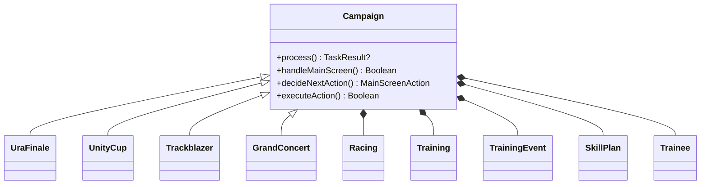
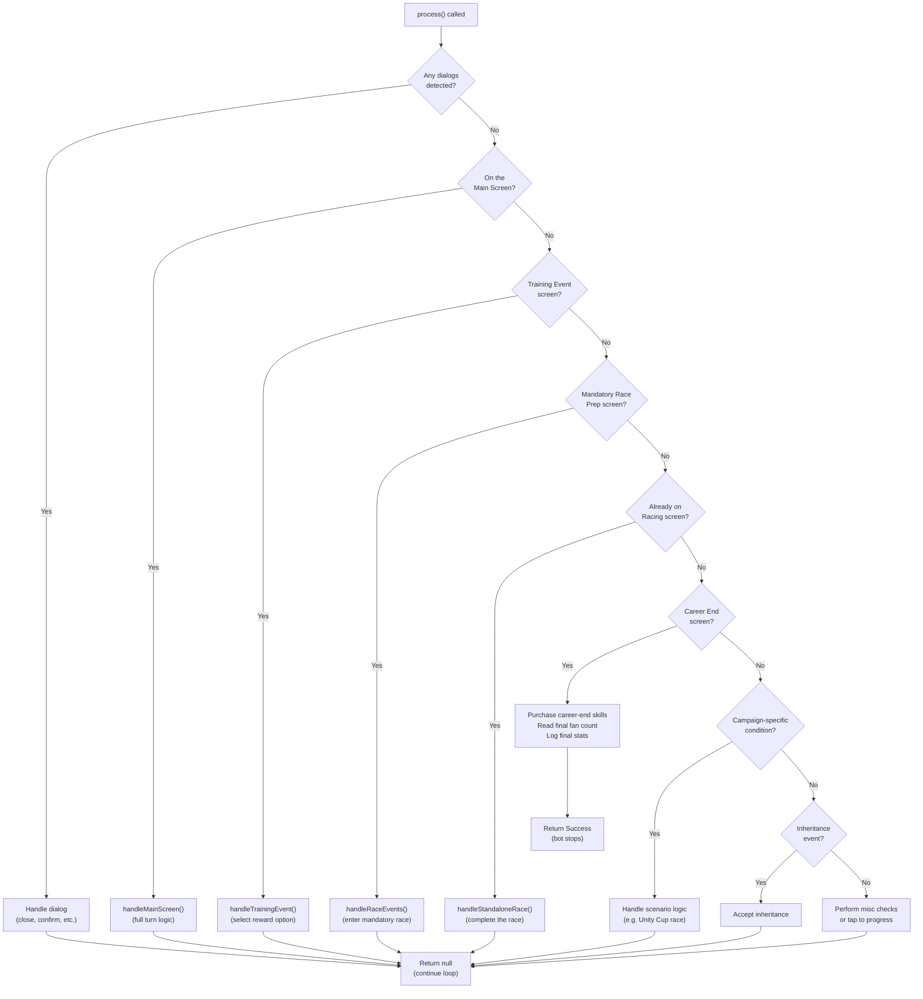
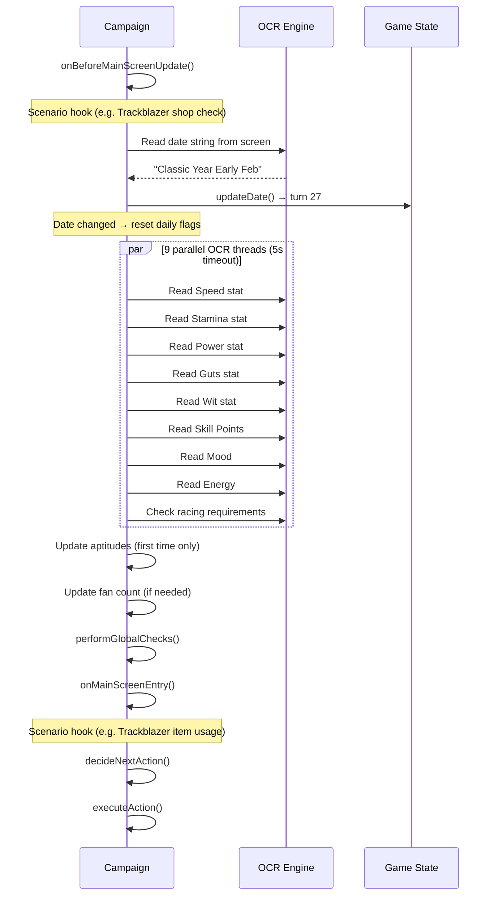
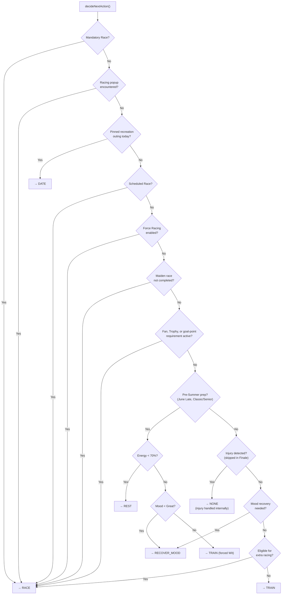
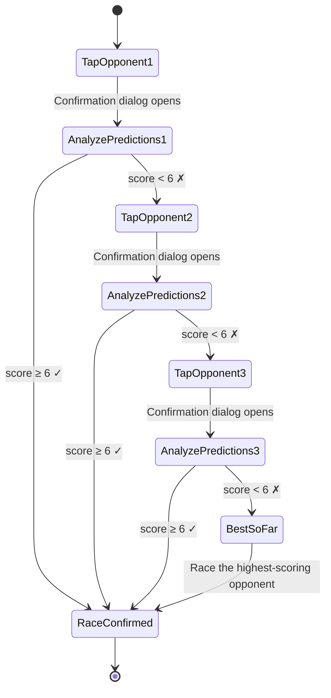
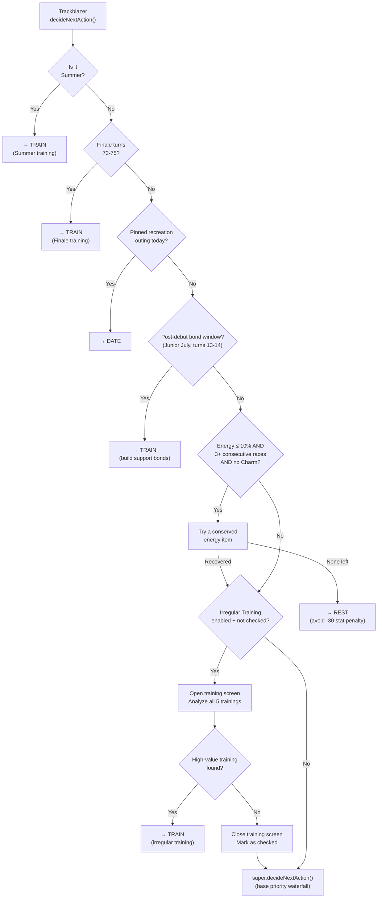

# How It Works

*Last updated: 2026-08-06*

A comprehensive guide to the inner workings of the app. This document explains what the bot does at each step of a campaign, how it makes decisions, and how each scenario differs.

## Table of Contents

- [1. Architecture Overview](#1-architecture-overview)
- [2. The Turn System](#2-the-turn-system)
- [3. The Main Loop](#3-the-main-loop)
- [4. A Turn in Detail](#4-a-turn-in-detail)
- [5. Decision Engine](#5-decision-engine)
- [6. Training System](#6-training-system)
- [7. Racing System](#7-racing-system)
- [8. Training Events](#8-training-events)
- [9. Scenario: URA Finale](#9-scenario-ura-finale)
- [10. Scenario: Unity Cup](#10-scenario-unity-cup)
- [11. Scenario: Trackblazer](#11-scenario-trackblazer)
- [12. Scenario: Grand Concert](#12-scenario-grand-concert)
- [13. Skill Purchasing](#13-skill-purchasing)
- [14. Spark Reroll and the Selection Chooser](#14-spark-reroll-and-the-selection-chooser)
- [15. The Start Persistence Barrier](#15-the-start-persistence-barrier)

---

## 1. Architecture Overview

The bot is an Android app built with a **React Native** frontend (settings UI, message log) and a **Kotlin** backend (automation engine). It uses the [Android CV Automation Library](https://github.com/steve1316/android-cv-automation-library) framework to interact with the game.

**How it sees the screen:** A `MediaProjectionService` captures the device screen. The bot then uses **OpenCV template matching** (TM_CCOEFF_NORMED with multi-scale search) to detect buttons, icons, and dialogs, **OCR** (Google ML Kit + Tesseract) to read text like stat values, event names, and race names, and optionally **YOLOv8 object detection** (via ONNX Runtime) to detect training stat gain digits with higher accuracy than template matching.

**How it interacts:** An `AccessibilityService` performs tap and swipe gestures on the device.

**How it decides:** The bot runs a `process()` loop that is called repeatedly by the `Game` class. Each call handles one "tick" — detecting which screen the game is on and taking the appropriate action.



The `Game` class instantiates the correct scenario subclass (`UraFinale`, `UnityCup`, `Trackblazer`, or `GrandConcert`) based on the user's selection, then calls `process()` in a loop until the campaign ends or the bot is stopped. The selection is normalized first, so a scenario stored under any of its accepted spellings still dispatches to one subclass.

### Module map

Ownership and boundaries for the parts whose responsibility is not obvious from the filename. The
full directory listing is not reproduced here — read the tree from the repository, which is always
current.

| Module | Responsibility |
|---|---|
| `Game.kt` | Top-level orchestrator. Owns the `Campaign` instance and drives the tick loop |
| `Task.kt` | Bot lifecycle — start, stop, runtime cap |
| `Campaign.kt` | Abstract base class for one career. Owns `Trainee`, `Racing`, `Training`, `SkillPlan`, the date, deck validation, the mood floor, and dialog dispatch |
| `StartModule.kt` | The JavaScript ↔ Kotlin bridge (start/stop, accessibility status) **and** the run queue |
| `CareerLaunchNavigator.kt` | The between-career state machine: career summary → home → set up and start the next run. Distinct from the in-career loop |
| `DialogHandler.kt` | Cross-cutting dialog dispatch for dialogs shared by all scenarios |
| `TrainingEventRecognizer.kt` | OCR plus a Jaro-Winkler matcher for event names |
| `components/` | Kotlin objects that wrap the template-match PNG assets. A component is the code-side handle for an image under `assets/images/components/` |
| `types/Trainee.kt` | Stats, aptitudes, mood, energy, conditions, and their OCR readers |
| `types/GameDate.kt` | Turn arithmetic and date OCR |
| `utils/CustomImageUtils.kt` | Bitmap helpers, OCR wrappers, scenario-aware support detection |

The frontend (`src/`) is a React Native settings and log UI. `src/context/BotStateContext.tsx` holds
the canonical `Settings` shape; `src/data/characterPresets.ts` holds the preset library. Kotlin reads
settings back through `SettingsHelper`, so a setting added on one side does nothing until it exists on
both.

---

## 2. The Turn System

A full campaign spans **75 turns** across 3 years plus a finale season:

| Year | Turns | Months |
|------|-------|--------|
| **Junior** | 1–24 | Pre-Debut (1–11), Debut Race (12), Post-Debut (13–24) |
| **Classic** | 25–48 | Regular (25–36), Summer (37–40), Regular (41–48) |
| **Senior** | 49–72 | Regular (49–60), Summer (61–64), Regular (65–72) |
| **Finale** | 73–75 | Qualifier (73), Semi-Final (74), Finals (75) |

Each year has 12 months with 2 phases each (Early and Late), totaling 24 turns per year. Months run from January through December.

```mermaid
gantt
    title Campaign Timeline (75 Turns)
    dateFormat X
    axisFormat %s
    section Junior Year
    Pre-Debut (1-11)     :a1, 1, 11
    Debut Race (12)      :milestone, m1, 12, 12
    Post-Debut (13-24)   :a2, 13, 24
    section Classic Year
    Regular (25-36)      :a3, 25, 36
    Summer (37-40)       :crit, a4, 37, 40
    Regular (41-48)      :a5, 41, 48
    section Senior Year
    Regular (49-60)      :a6, 49, 60
    Summer (61-64)       :crit, a7, 61, 64
    Regular (65-72)      :a8, 65, 72
    section Finale
    Qualifier (73)       :crit, a9, 73, 73
    Semi-Final (74)      :crit, a10, 74, 74
    Finals (75)          :crit, a11, 75, 75
```



> [!NOTE]
> Sections highlighted in red are **special periods** where normal gameplay rules change — Summer blocks racing entirely, and Finale forces mandatory back-to-back races.

**Key periods:**
- **Pre-Debut (turns 1–11):** No races are available yet. The bot focuses on training and building relationships.
- **Summer (turns 37–40 and 61–64):** Training-only period. No races can be entered (unless using the in-game race agenda override).
- **Finale (turns 73–75):** Three mandatory back-to-back races. Injury and consecutive race checks are skipped.

**Date detection:** The bot reads the date string from the screen via OCR (e.g., "Classic Year Early Feb") and converts it to an internal turn number. During Pre-Debut, it reads a "turns remaining" countdown instead. During Finale, it detects the goal text or Trackblazer's "X/3" indicator.

---

## 3. The Main Loop

Every tick of the bot calls `process()`, which checks the current screen and dispatches to the appropriate handler:



**Key points:**
- **Dialogs are always checked first.** Any popup (confirmation, warning, tutorial) is handled before any other logic runs.
- **Main Screen handling** is where the core turn logic lives — stat updates, decision-making, and action execution all happen here.
- **Training Events** appear after a training or race completes and offer reward choices.
- **Campaign-specific conditions** (`checkCampaignSpecificConditions()`) allow each scenario to inject custom screen detection: Unity Cup's opponent selection screen, or Grand Concert's concert-pending and Complete Career screens.
- If no known screen is detected, the bot taps the screen to try to progress past any intermediate animation or transition.

> [!TIP]
> The main loop is designed to be **idempotent** — each call to `process()` handles exactly one screen transition. If the game is between screens or in an animation, the bot simply taps and waits for the next tick.

---

## 4. A Turn in Detail

When the bot detects it is on the Main Screen, `handleMainScreen()` orchestrates the full turn:



### 4.1 Parallel Turn-Start Updates

Every time the date changes, the bot reads the trainee's current state using **9 parallel OCR threads** coordinated by a `CountDownLatch` with a **5-second timeout**:

| Thread | Reads | Method |
|--------|-------|--------|
| 1–5 | Speed, Stamina, Power, Guts, Wit | `trainee.updateStats()` |
| 6 | Skill Points | `trainee.updateSkillPoints()` |
| 7 | Mood (icon-based detection) | `trainee.updateMood()` |
| 8 | Racing requirements (fans/trophies) | `racing.checkRacingRequirements()` |
| 9 | Energy (bar position) | `trainee.updateEnergy()` |

Thread 8 (racing requirements) is **skipped during summer** since no races are available, leaving 8 threads. The one exception is a user in-game race agenda with summer training skipped: that combination can still race in summer, so the thread stays. Logging output is temporarily disabled during parallel reads to avoid garbled messages, then re-enabled after all threads complete.

> [!WARNING]
> If any thread fails to complete within the 5-second timeout, the bot logs an error and continues with whatever data it managed to read. Stat values that timed out retain their previous values. The bound exists only to cap a hung thread; the whole set normally finishes in well under two seconds.

### 4.2 Global Checks

After stat updates, the bot performs several global checks that can stop or pause the campaign:

1. **Pre-Finals Skill Shopping (turn 72):** If the `preFinals` skill plan is enabled, the bot opens the skill shop and purchases skills before entering the finale.
2. **Skill Point Threshold:** If skill points reach the configured threshold, the bot either runs the `skillPointCheck` skill plan or stops entirely.
3. **Stop Before Finals:** If `enableStopBeforeFinals` is on and the bot reaches turn 72, it stops so the user can take over for the finals.
4. **Stop at Date:** If the current date matches any user-configured stop dates, the bot stops.

### 4.3 Scenario Hooks

Each scenario can override these hooks to inject custom logic at specific points in the turn:

| Hook | When Called | Example Usage |
|------|-----------|---------------|
| `onBeforeMainScreenUpdate()` | Before date detection | Trackblazer: check if shop visit is needed. Grand Concert: open the Lesson shop and spend performance points |
| `onAfterTurnStartUpdates()` | After parallel OCR reads | Additional post-update logic |
| `onMainScreenEntry()` | Before decision-making | Trackblazer: use training items |
| `onScheduledRacePrepScreen()` | On the Race Prep screen before a scheduled or mandatory race | Trackblazer: use race items (hammers, glow sticks) |
| `handleRaceEventFallback()` | When a race attempt fails (e.g. consecutive race limit) | Trackblazer: back out and train instead (non-mandatory races only) |
| `resetDailyFlags()` | When date changes | Reset scenario-specific per-turn flags |

The hooks above fire at points *within* a turn. Separately, a scenario subclass can override these
core `Campaign` members, which define the turn itself:

| Override | Purpose |
|---|---|
| `process()` | Called every tick from `Game`. Detects the current screen and dispatches |
| `handleMainScreen()` | Decides the next action while on the Home training screen |
| `handleRaceEvents(isScheduledRace)` | Scenario-specific race entry. Trackblazer, for example, restricts which prediction tiers it will enter |
| `handleDialogs(args)` | Dialog dispatch; cascades to `DialogHandler` for dialogs shared across scenarios |
| `checkCampaignSpecificConditions()` | Screen detection a scenario owns. Unity Cup: the opponent selection screen. Grand Concert: the concert-pending screen (its Complete Career screen is recognised by `checkEndScreen` instead, so the shared career-end path owns it) |
| `checkEndScreen()` | Career-end detection. The default matches the shared Complete Career button template; Grand Concert also accepts its own pixel probe, because the probe recognises the screen mid-fade before the template clears its confidence gate, and losing that race once stranded a career with every skill point unspent (2026-07-26) |
| `openCareerEndSkillScreen()` | How the career-end skill screen is reached. The default clicks the shared Learn button; Grand Concert drains leftover performance points first, then uses the Complete Career layout's own Skills button, because the shared template does not exist on that screen. A drain that never saw the Lessons list stays retryable rather than counting as done |
| `shouldRecoverMood(sourceBitmap)` | Mood-floor check, configurable through the `moodFloor` setting |
| `recoverMood(...)` / `performMoodRecovery(...)` | The mood-recovery action paths |
| `runDeckValidation()` | One-shot check at career start. Warns when preferred-distance or preferred-style aptitude is below the floor, then warns on prediction visibility when the best distance aptitude is below B. Informational — it does not block |

---

## 5. Decision Engine

The `decideNextAction()` method determines what the bot should do this turn. It follows a strict **priority waterfall** — the first matching condition wins:



**Priority explanations:**

1. **Mandatory Race:** If the game shows a career-goal race ribbon, the bot must race. No choice here.
2. **Racing popup:** If a previous race selection triggered a popup that wasn't fully resolved, continue with racing.
3. **Pinned recreation outing:** A recreation turn pinned by the dating schedule. It sits between the two race checks deliberately: a mandatory career-goal race still outranks it, but it outranks a scheduled in-game agenda race. With the dating schedule off this is a settings-only check that costs nothing.
4. **Scheduled Race:** A race the user's in-game agenda has scheduled for this turn.
5. **Force Racing:** User setting that bypasses all other logic and forces racing every turn.
6. **Maiden Race:** The first race of the campaign must be completed before regular training resumes.
7. **Fan/Trophy/Goal-point Requirements:** If the game requires a minimum fan count, trophy count, or goal race points, the bot prioritizes racing to meet it. This deliberately outranks the pre-summer prep below, because the forced rest or mood turn would otherwise eat the very turn the requirement needed. If no race turns out to be available, the flags reset and the turn falls back to training.
8. **Pre-Summer Prep (June Late):** On the last turn before Summer training, the bot ensures energy is high (≥70%) and mood is Great. If energy is low, it rests. If mood is low, it recovers mood. If both are fine, it trains Wit (which recovers some energy in preparation for Summer Training).[^1]
9. **Injury Check:** If an injury is detected, the bot handles it (usually by resting). This check is **skipped during Finale turns** since those races are mandatory.
10. **Mood Recovery:** If mood has dropped to Normal or below, the bot recovers before training (bad mood penalizes training gains).
11. **Extra Racing:** If the bot is eligible for extra races (based on farming fans, racing plan, or smart racing logic), it races.
12. **Default: Train.** If nothing else applies, the bot trains.

[^1]: Wit is chosen as the "throwaway" training because it recovers some energy, helping the trainee enter Summer Training in better condition.

> [!NOTE]
> **Trackblazer override:** Trackblazer's `decideNextAction()` layers several hijacks over the base waterfall before delegating to it: summer training, finale training, a pinned recreation outing, the post-debut bond window, and a low-energy guard, and last of all **Irregular Training**: evaluating whether a high-value training opportunity exists that's worth skipping a race for. See [Section 11.6](#116-irregular-training) for details.

### 5.1 Outcome Measurement

Every career ends with a structured `[CAREER_END]` log line carrying an `outcome=` label — `COMPLETED` (reached the career-end screen with no confirmed force-end), `FORCE_END` (a lost mandatory race the bot could not retry past), or `INCOMPLETE` (a non-completion result: user stop, watchdog timeout, or unhandled exception). The game shows the same end screen for a win and an early force-end, so within `COMPLETED` the end turn is the tell: a full arc ends near the scenario's last turn, a force-end ends early.

Alongside the log line, each career appends one JSON record to an on-device corpus (`files/outcomes/careers.jsonl`) carrying those fields plus the app version and a **config fingerprint** — a stable hash of the tunables that shape play (stat priorities and targets, racing flags, the racing-plan content, skill threshold, mood floor, and the Trackblazer overrides), snapshotted when the campaign is constructed so a rotation switch between runs cannot mislabel the record. A dev-side tool (`scripts/analyze-outcomes.mjs`, backed by `src/lib/outcomeAnalysis.ts`) reads the corpus — and harvests the older ledger lines out of pulled message logs — and reports per-trainee outcome distributions per config arm: how many full arcs versus early exits, fan and stat percentiles, and the turns each arm tends to die at. This is what lets a tuning change be measured across many runs instead of judged one at a time.

### 5.2 Decision Trace Records

The `[DECISION]` Decision Report block above is written for a human reading one run's log. `DecisionTrace` (`bot/DecisionTrace.kt`) writes the same turn's evidence a second time as a machine-readable JSON line, so a turn can be examined across many careers without parsing log prose.

**What it records.** One record per main-screen turn: the identity of the career, the game date, the state the decision engine saw when the turn opened, the candidates it named, and the action it committed to.

- Identity: record `type` and version, wall-clock `ts`, app version, config fingerprint (`fp`), scenario, trainee, applied preset, `careerToken` (the same career identity the finalization records use, so traces join to them directly), and `queueRun`.
- Date: `turn` plus `year` / `month` / `phase`.
- State: energy, mood, the five stats, skill points, fans, negative statuses, and any scenario inventory or extra state the campaign passes to the tracer. This is the snapshot taken when the turn opened, not live state at write time, because the turn's action has already run by then.
- `observation`: whether the turn number, stats, skill points and aptitudes came from an actual read this career rather than a carried-over or default value. These are the read flags the existing readers already maintain. They are not confidence scores, because those readers do not expose one, and none is invented.
- `candidates`: a flat list of what was considered. Main-screen actions carry the chosen one plus each alternative the priority cascade explicitly ruled out. Trainings carry the analyzer's pick plus its runner-ups with their scores, failure chances and stat gains.
- `selected`: the committed action and its reason, the training pick and which branch of `recommendTraining` produced it, and a `recovery` block when the turn abandoned its pick and executed a recovery instead.
- `raceEligibility`, `items` and `notes` when the turn recorded them.

**Where.** `files/outcomes/decisions.jsonl` under the app's external files dir, appended one record per line through the same `OutcomeCorpus` writer the career corpus uses. It is a separate file on purpose: a career writes one outcome record but roughly 75 traces, so interleaving them would bury the rows the outcome analyzer reads. The file has a byte cap (`DecisionTrace.MAX_FILE_BYTES`); past it records are dropped with one warning rather than filling the device. Nothing is rotated or deleted.

**When.** Tracing rides the existing Decision Report gate: debug builds, or Debug Mode enabled in settings. There is no separate toggle. Release builds without Debug Mode allocate nothing and write nothing.

**Versioning.** `type` is `decision_trace` and `v` is the schema version. Purely additive fields keep the current version, so a reader must ignore fields it does not know. Renaming or removing a field, or changing the meaning or units of one, bumps `v`.

**Best-effort and non-authoritative.** The record is written inside `DecisionTracer.emit()`, which runs *after* the turn's action has executed. It observes the decision; it never participates in it. A serializer exception is caught there and warned once per career; a disk-append failure is caught one layer down in `OutcomeCorpus` and warned per failed append; either way the record is dropped and the turn continues -- it is not retried, no tap repeats, and the run goes on. The same observed state produces the same action whether tracing is on, off, or broken. The corpus is therefore evidence about a run, never a source of truth about one, and it is not one-row-per-turn: a turn that ends in a dialog before the action tick never opens a trace window.

**Optional fields.** Everything except `type`, `v`, `ts`, `observation` and `selected` is conditional, and an unavailable value is omitted rather than filled in. In particular `turn` is absent when the date was never read (the constructed default is turn 1, and writing that as real already produced phantom rows in the career corpus); a candidate `score` is absent for a hard-excluded training because no real ranking existed for it; `gains` carries only the stats the caller supplied; and `selected` is empty when the turn committed to nothing. `careerToken` falls back to a per-campaign nonce when no career task installed an identity. A `seq` field, when present, is the additive per-career sequence that joins this trace to its `career_state` record (see 5.3); it is absent on older records and on any turn for which no career-state snapshot was built.

**Example** (redacted; key order is not stable, since the writer uses a hash map, and is shown here grouped for readability):

```json
{
  "type": "decision_trace", "v": 1, "ts": 1785312000000, "app": "1.4.0",
  "fp": "1e681a57e1", "scenario": "Trackblazer", "trainee": "Biwa Hayahide",
  "preset": "Biwa Hayahide", "careerToken": "Biwa Hayahide|Trackblazer|run2|3f9a1c22",
  "queueRun": 2, "turn": 25, "year": "CLASSIC", "month": "JANUARY", "phase": "EARLY",
  "state": {"energy": 62, "mood": "GOOD", "skillPts": 340, "fans": 12000,
            "spd": 412, "sta": 300, "pwr": 288, "grt": 190, "wit": 260},
  "observation": {"turnObserved": true, "statsObserved": true,
                  "skillPointsObserved": true, "aptitudesObserved": true},
  "settings": {"Mood Floor": "GOOD"},
  "candidates": [
    {"type": "action", "id": "TRAIN", "selected": true, "reason": "default action: no race required, no recovery needed, no extra race eligible"},
    {"type": "action", "id": "RECOVER_MOOD", "selected": false, "rejected": true, "reason": "mood GOOD at/above floor GOOD"},
    {"type": "training", "id": "SPEED", "selected": true, "failChance": 8, "gains": {"spd": 11, "pwr": 2}, "reason": "won analysis (Year 2+) with score 41.50"},
    {"type": "training", "id": "WIT", "selected": false, "rejected": false, "score": 12.25, "failChance": 3, "reason": "outscored"},
    {"type": "training", "id": "GUTS", "selected": false, "rejected": true, "reason": "excluded (hard penalty)"}
  ],
  "raceEligibility": {"eligible": false, "reason": "not eligible for an extra race this turn"},
  "selected": {"action": "TRAIN", "source": "action_choice", "reason": "default action: no race required, no recovery needed, no extra race eligible",
               "training": "SPEED", "trainingSource": "ANALYSIS", "trainingReason": "won analysis (Year 2+) with score 41.50"}
}
```

**Coverage.** Only the main-screen turn boundary emits traces today, which covers the action choice, the training contest and extra-race eligibility for every scenario, including Trackblazer's own action hijacks (they record through the same tracer). Decisions resolved outside that window are not covered and stay in their existing chronological log tags: race selection and running-style resolution (`[RACE]` and `[DIALOG]`, since the strategy is resolved in the race-prep dialog handler rather than in an open turn), skill purchasing (`[SKILLS]` / `[KNAPSACK]`, whose career-end knapsack runs after the last turn), training-event choices (`[TRAINING_EVENT]`), and spark reroll (`[SPARKS]`).

**Intended consumers.** The corpus exists so that later analysis work has something to read: comparing what the bot chose against what it should have chosen, studying which observations preceded bad turns, or checking a scoring change turn by turn instead of by career outcome. None of those tools exist yet, and nothing in the app reads the file.

### 5.3 Career State Records

`CareerState` (`bot/CareerState.kt`) is a second, separate telemetry stream that captures the coherent pre-decision world facts the engine sees, and is written as its own `career_state` record type. It is deliberately **not** the same thing as a decision trace, and the two are never merged into one file:

- A **decision-trace** `state` block is the **turn-open** snapshot the tracer took when the turn's window opened, paired with the decision evidence for that turn.
- A **career-state** record is the immutable **pre-decision** snapshot taken later in the same turn, immediately before `decideNextAction()` runs, after turn-start reads, race-cache refresh, global checks and the scenario's `onMainScreenEntry()` have all landed. Race-cache buys, global-check skill purchases and item use can occur between those two boundaries, so the two snapshots are related but not identical, and neither is derivable from the other.

**What it records.** The career identity (`careerToken`, scenario, trainee, preset, queueRun, `fp`), the observed date, condition (energy, mood, statuses), the five stats, skill points, aptitudes, the three cached race-day flags, the scenario extension, and group `provenance`. It follows the same honesty rules as the decision trace: a group that was never read this career is omitted rather than filled with a default, the date components appear only when the date was actually read, and `provenance` labels each group `observed` / `unread` / `configured` / `derived`. Fans are deliberately excluded (no per-field read flag exists, so a default fan count could not be labelled observed), and no candidate, score or selection evidence appears here -- that stays decision-trace-owned.

**Where and when.** `files/outcomes/career_state.jsonl`, one record per line through the same `OutcomeCorpus` writer with its own byte cap, kept out of `decisions.jsonl` on purpose so each file's reader can reject the other record type. It rides the same debug / Debug-Mode gate and the same non-fatal, shadow-only policy: it is written at the pre-decision boundary, nothing in the gameplay path reads it, and a serialization or append failure is swallowed so a telemetry fault can never change a turn.

**The `seq` join key.** Each career-state record carries a per-career monotonic `seq`, allocated exactly once when the build opportunity for a new logical decision turn is consumed (so same-turn re-ticks do not advance it, and it does not depend on date OCR). The same `seq` is added as an optional additive field on the newly-emitted decision-trace records for that turn. Offline analysis joins the two streams by **`careerToken + seq`**, never by the observed turn or date: the turn number is a diagnostic that is absent whenever date OCR failed, so it cannot be the join authority. A resumed career starts a new `careerToken`, so restarting `seq` at 1 keeps the composite key unique. Because the sequence is retained on the campaign and read at emit time -- which happens after the action has already re-armed the turn latch for the next turn -- a trace stamps its own turn's `seq` rather than the next turn's.

**Missing joins are coverage, not corruption.** A career-state record with no matching trace is legitimate on an unknown-date turn where the tracer never opened a window; a trace with a `seq` but no matching state is legitimate after a swallowed career-state build or a dropped append. The offline analyzer reports these as diagnostics. Only a duplicate `(careerToken, seq)` composite key -- which the writer cannot legitimately produce -- is treated as a consistency error. `career_finalize` remains the owner of the career outcome, and a future ReplayLab is the consumer that would join all three.

---

## 6. Training System

The training system analyzes all 5 training options (Speed, Stamina, Power, Guts, Wit), scores them, and selects the best one.

### 6.1 Training Analysis Pipeline

When `analyzeTrainings()` is called:

1. **Iterate all 5 stats:** For each stat, the bot clicks the corresponding training tab button.
2. **Stat gain detection per training:**
   - Main stat gain and sub-stat gains (detected via template matching or optionally **YOLO** — see below)
   - Failure chance percentage
   - Relationship bar colors (blue, green, orange) for support card characters present
   - Rainbow count (number of rainbow indicators)
   - Skill hints available
3. **Results are cached** for the current turn in `cachedAnalysisResults` to avoid re-reading if the training screen is visited multiple times.
4. **Filtering:** Trainings exceeding the maximum failure chance threshold (default 20%) are excluded, unless risky training mode or Good-Luck Charm overrides are active.

**YOLO Stat Detection:** When `enableYoloStatDetection` is enabled, stat gain digits are detected using a **YOLOv8 nano** model (`best.onnx`) instead of template matching. The model is trained to detect 11 classes (digits 0–9 and the '+' symbol) in small crops around each stat's gain number (130x50 in the training set; the runtime crop is sized from the live row). It runs via ONNX Runtime with a confidence threshold of 0.8 and IoU threshold of 0.45 for NMS. The `YoloDetector` is loaded once as a singleton and kept in memory. Both detection methods coexist; the setting controls which one is used at runtime. The YOLO training pipeline and model export tools live in the [yolo/](yolo/) directory.

### 6.2 Scoring Algorithm

Each training option receives a weighted score from `calculateRawTrainingScore()`:

$$\text{Score} = \bigl(\text{StatEfficiency} \times w_{\text{stat}} + \text{Relationship} \times w_{\text{rel}} + \text{Misc} \times w_{\text{misc}}\bigr) \times \text{RainbowMultiplier}$$

| Component | Weight (with relationships) | Weight (without) | What It Measures |
|-----------|---------------------------|-------------------|-----------------|
| Stat Efficiency | 60% | 70% | How much the stat gain moves toward the target for the trainee's distance |
| Relationship | 10% | 0% | Support card relationship bar progress (blue = 2.5, green = 1.0, orange = 0.0) |
| Misc | 30% | 30% | Mood gain, bond progress, skill hints, and other bonuses |

**Rainbow Multiplier:**
- If rainbow training bonus is enabled: **2.0x**
- If rainbow training bonus is disabled but rainbows are present: **1.5x**
- No rainbows: **1.0x**

Rainbow training is heavily favored because it improves overall stat ratio balance. Applied only from Classic Year onward.

**Anticipatory rainbow bonus:** From Year 2 onward, a training that has no rainbow yet but shows at least one support bar heading toward maximum friendship (blue or green, past 10% fill) receives a smaller rainbow-style multiplier, scaled by how full those bars are and capped at 1.6x, well below a real rainbow. It nudges the bot toward a room that is one turn away from rainbowing instead of spending that turn elsewhere. Gated on the `enablePrioritizeNearMaxFriendship` setting (on by default).

> [!IMPORTANT]
> **Stat Cap Awareness:** If a stat is at or above the effective cap, training for that stat scores **0** and is skipped. The effective cap is the absolute cap less a 100-point buffer, less a reserve for the stats the remaining finale races will still award (15 per race, so 45 for any turn up to 72, shrinking to 0 by the last turn). The one exception is a **one-time rainbow allowance**: a stat can be trained past the buffer if it's a rainbow training and that stat hasn't used this allowance yet.

### 6.3 Special Training Modes

<details>
<summary><strong>Risky Training</strong></summary>

When enabled, the bot will accept trainings with higher failure chances if the stat gain is large enough:
- **Minimum stat gain:** Configurable (default 30)
- **Maximum failure chance:** Configurable (default 25%)

This overrides the normal failure chance filter for trainings that meet both thresholds.
</details>

<details>
<summary><strong>Rainbow Training Bonus</strong></summary>

When enabled, rainbow trainings receive a 2.0x score multiplier instead of 1.5x. This makes the bot more aggressively pursue rainbow training opportunities, which provide balanced stat gains across multiple categories.
</details>

<details>
<summary><strong>Train Wit During Finale</strong></summary>

During Finale turns (73–75), if the trainee's energy is too low for optimal training, the bot normally rests. With this setting enabled, it **trains Wit instead of resting**, since:
- Energy recovery is less valuable when only 1–3 turns remain
- Wit training typically has low failure chance
- On turn 75 (the final turn), resting is completely pointless, so Wit is always forced
</details>

<details>
<summary><strong>Skill Hint Prioritization</strong></summary>

When enabled, the bot adds bonus weight to trainings that offer skill hints, making it more likely to choose trainings where support cards are offering learnable skills.
</details>

### 6.4 Training Configuration Summary

| Setting | Default | Effect |
|---------|---------|--------|
| Stat Prioritization | Wit, Speed, Power, Stamina, Guts | Order determines scoring weight for stat gains |
| Training Blacklist | (empty) | Stats in this list are never selected |
| Max Failure Chance | 20% | Trainings above this are filtered out |
| Disable on Maxed Stat | true | Skip training for stats at/above buffer |
| Rainbow Training Bonus | true | 2.0x multiplier for rainbow trainings |
| Train Wit During Finale | false | Wit training instead of resting during finale |
| Risky Training | true | Accept higher failure for larger gains |

---

## 7. Racing System

The racing system handles race detection, selection, execution, and result processing.

### 7.1 Race Types

| Type | Detection | When |
|------|-----------|------|
| **Mandatory** | `IconRaceDayRibbon` or `IconGoalRibbon` | Game-forced races (Debut, Finale, goal races) |
| **Scheduled** | `LabelScheduledRace` | Races from the user's in-game agenda |
| **Extra** | Eligibility check | Fan farming, racing plan, or smart racing |
| **Maiden** | First race flag | Must be completed once before regular training |

### 7.2 Extra Race Eligibility

The bot determines if extra races should be run via `checkEligibilityToStartExtraRacingProcess()`:

- **Force Racing:** Always race if the setting is enabled.
- **Fan/Trophy Requirements:** Race to meet minimum thresholds shown on screen.
- **Racing Plan:** User-defined schedule of specific races to enter on specific turns.
- **In-Game Race Agenda:** Follows the agenda set within the game itself.
- **Fan Farming:** Enters races based on a configurable interval (`daysToRunExtraRaces`).
- **Smart Racing / Look-Ahead:** Checks upcoming turns for higher-quality races and may defer racing to a better opportunity.

> [!IMPORTANT]
> **Trackblazer** bypasses smart racing logic entirely and races as aggressively as possible, only stopping for summer, finals, or when the consecutive race limit is reached.

### 7.3 Race Selection

When the bot decides to race:

1. **Open the race list** and scan available races.
2. **Database lookup:** Each detected race name is matched against an internal race database keyed by turn number. The database contains grade, fan reward, surface, and distance information.
3. **Grade priority:** G1 > G2 > G3 > OP > Pre-OP. Higher-grade races are always preferred. The race path also reads each row's **prediction-icon tier** (`PredictionTier`: NONE / SINGLE / DOUBLE); double-star rows are preferred and single-star rows are admitted only as last-resort candidates (see [Section 11.7](#117-race-selection) for the Trackblazer tier gating).
4. **Filtering:** Races can be filtered by minimum fan threshold, preferred terrain, preferred grades, and preferred distances.
5. **Selection:** The highest-priority race that passes all filters is selected.

### 7.4 Race Execution

Once a race is selected:

1. **Strategy Selection:** The bot selects a running strategy (Front Runner, Pace Chaser, Late Surger, or End Closer) based on the trainee's aptitudes.
2. **Skip or Manual:** If the "skip" button is available, the bot skips the race animation. Otherwise, it watches and fast-forwards.
3. **Retries:** If a race is lost and retries are enabled, the bot can retry the race (free retry available once per campaign if enabled). Mandatory races additionally retry toward 1st place while a retry is available — bounded by the free-retry count and re-checking the Congratulations banner on a fresh capture first, so a race that was already won is never retried.
4. **Complete Career on Failure:** If a mandatory race is lost and this setting is enabled, the bot continues the campaign anyway rather than stopping.

> [!CAUTION]
> Losing a mandatory race without `enableCompleteCareerOnFailure` will **stop the bot entirely**. If you want fully unattended runs, make sure this setting is enabled.

---

## 8. Training Events

Training events are popup screens that appear after training or racing, offering the player a choice between 2+ reward options.

### 8.1 Event Detection

1. The bot detects the training event screen via template matching (`IconTrainingEventHorseshoe`).
2. **OCR reads** the event title and the character or support card name.
3. **Fuzzy string matching** (Jaro-Winkler algorithm) compares the detected text against the event database to identify which event this is and what each option rewards.

### 8.2 Override System

The bot checks for overrides in this priority order:

| Priority | Override Type | Description |
|----------|--------------|-------------|
| 1 | **Special Event** | Hardcoded overrides for game-critical events (New Year's, Shrine Visit, etc.) |
| 2 | **Character Event** | User-configured choice for a specific character's events |
| 3 | **Support Event** | User-configured choice for a specific support card's events |
| 4 | **Scenario Event** | User-configured choice for scenario-specific events |
| 5 | **Default Scoring** | Weighted algorithm (see below) |

If any override matches, its configured option is selected immediately without scoring.

### 8.3 Default Scoring

When no override applies, each option receives a weight score based on its rewards:

| Reward Type | Weight | Notes |
|-------------|--------|-------|
| "Can start dating" | +1000 | Extremely high priority — unlocks dating events |
| "Event chain ended" | -300 | Penalty — ending an event chain loses future rewards |
| "(Random)" | -10 | Small penalty for uncertain outcomes |
| "Randomly" | +50 | Mild bonus for partially random outcomes |
| Energy gain | value × multiplier | Multiplier scales with current energy[^2] (4x at <30%, 3x at <50%, 2x at <70%, 0x at ≥90%). If "Prioritize Energy" is enabled, multiplier is 100x |
| Mood gain | 80–150 | Higher weight when mood is lower (150 at Awful, 0 at Great). Mood loss: -150 |
| Bond gain | +20 | Bond loss: -20 |
| Skill hint | +25 | Learning a new skill |
| Positive status | +25 | Gaining a beneficial condition |
| Negative status | -25 | Gaining a harmful condition |
| Stat gain (priority stat) | value + 10–50 bonus | Bonus based on stat priority rank (1st: +50, 2nd: +40, 3rd: +30, 4th: +20, 5th: +10) |
| Stat gain (other) | raw value | No priority bonus |
| Skill points | raw value | Direct skill point gains |

[^2]: The energy multiplier is intentionally aggressive — at low energy, even small energy gains receive high scores because training at low energy carries significant failure risk.

The option with the **highest total weight** is selected.

> [!TIP]
> You can override the bot's event choices for specific characters, support cards, or scenario events in the **Training Event Settings** page. Overrides take priority over the scoring algorithm, letting you force a specific option for events you know are better than what the bot would calculate.

---

## 9. Scenario: URA Finale

URA Finale is the **simplest scenario**. It uses the base `Campaign` logic almost unchanged, with three overrides:

- **`openFansDialog()`:** Uses a different button location (`ButtonHomeFansInfo` in the top half of the screen) to open the fans information panel.
- **`capturesFinaleWins`:** Set to `true`, so finale race results are recorded for the career outcome.
- **`checkCampaignSpecificConditions()`:** Dispatches the **URA Duel** handler, the one scenario screen URA Finale adds on top of the shared loop. It OCRs the header band for "Contest of", picks the trainee's highest stat to duel with, pages the option carousel until that stat is showing (capped at six taps, since the duel offers five stats plus energy), and confirms. It then re-reads the header: if the duel screen is still up, the confirm tap missed, and it hands back to unknown-screen recovery rather than reporting success and blinding the stall watchdog.

Everything else, decision logic, training, racing, events, and finale handling, uses the standard base implementation described in sections 3–8.

> [!TIP]
> If you're new to the bot, URA Finale is the best scenario to start with since its behavior is entirely described by the shared systems in sections 3–8 with no scenario-specific complexity.

**Finale behavior (turns 73–75):**
- All 3 finale races (Qualifier, Semi-Final, Finals) are **mandatory**.
- **Injury checks are skipped** during the finale since the races must be run regardless.
- **Consecutive race warnings** are automatically confirmed.
- If `trainWitDuringFinale` is enabled, the bot trains Wit instead of resting between finale races.
- If `enableStopBeforeFinals` is enabled, the bot stops at turn 72 so the user can manually handle skill purchases or other preparations.
- If the `preFinals` skill plan is enabled, the bot automatically purchases skills on turn 72 before entering the finale.

---

## 10. Scenario: Unity Cup

Unity Cup adds a unique opponent selection and race system on top of the base campaign.

### 10.1 Tutorial Handling

The first time a Training Event screen appears, the bot checks for the Unity Cup tutorial header (`IconUnityCupTutorialHeader`). If detected, it selects the second option to close it and sets a flag to skip this check on subsequent turns.

### 10.2 Opponent Selection

When a Unity Cup race is triggered, the bot enters an opponent selection screen with 3 opponents to choose from:



**How it works:**

1. The bot detects 3 opponent positions via `LabelUnityCupOpponentSelectionLaurel`.
2. Starting with Opponent 1, it taps the opponent and then the "Select Opponent" button.
3. A confirmation dialog opens showing race predictions. The bot counts both **double circles** (`IconDoubleCircle`) and **single circles** (`IconSingleCircle`) in the middle region of the screen, then scores the matchup as `doubles * 2 + singles`. This is a weighted score, not a raw circle count: two doubles plus two singles scores 6, the same as three doubles.
4. If the score reaches **6 or higher** → the matchup is favorable. The bot confirms the selection.
5. If it falls short → the bot closes the dialog and tries the next opponent, remembering the best score seen so far.
6. **Fallback:** If no opponent clears the bar, the bot races the **highest-scoring** opponent of the three.

> [!NOTE]
> Because the counts come from template matches, an implausible read (more than five circles across five slots) clamps the single-circle count and logs a warning, so a false-matching template cannot inflate a matchup into a confident win.

### 10.3 Race Execution

After selecting an opponent:

- The bot checks if the "See All Race Results" button is **locked** (via `checkDisabled()`).
  - **Locked:** The bot clicks "Watch Main Race" and runs the race manually with retries.
  - **Unlocked:** The bot clicks the skip button to instantly see results.
- The race sequence ends when `IconUnityCupRaceEndLogo` is detected, at which point the bot clicks "Next" to return to the main screen.
- **Finals race** (`ButtonUnityCupRaceFinal`): When racing Team Zenith in the finals, the bot sets `bIsFinals = true` which auto-confirms the opponent dialog without prediction analysis.

### 10.4 Training Scoring

Unity Cup uses a modified training scoring mode during Junior and Classic years that factors in the **Spirit Gauge** mechanic:

- **Spirit Burst Bonus:** +800 base + 400 per gauge ready to burst (so one ready gauge is worth 1200)
- **Facility Preference:** +200 for Speed/Wit facilities; conditional for Stamina/Power/Guts
- **Gauge Fill Bonus:** +300 base + 100 per fillable gauge, with +200 bonus in the early game
- **Relationship:** 1.5x scaled relationship score

From Senior Year onward, Unity Cup switches to the standard stat efficiency scoring described in [Section 6.2](#62-scoring-algorithm).

---

## 11. Scenario: Trackblazer

Trackblazer is the **most complex scenario**, adding a shop system, item management, consecutive race tracking, irregular training evaluation, and custom race selection.

### 11.1 Overview and Flow Differences

Trackblazer overrides the decision engine to add several scenario-specific checks before falling through to the base logic:



> [!IMPORTANT]
> **Key difference from base Campaign:** During Finale, Trackblazer **trains** instead of racing. The 3 finale races are still mandatory, but between them the bot prioritizes training over rest (unlike URA Finale which follows the standard logic).

**Race fallback behavior:** If a non-mandatory race attempt fails (e.g. the consecutive race limit is reached after selecting a race), Trackblazer backs out of the race dialogs and falls back to training for the turn instead of erroring out. Mandatory races are not affected — those always proceed normally.

**Race-commitment override:** A scheduled, mandatory, or goal-ribbon race this turn (checked by `isRaceCommitmentTurn()`, from the turn-start cached flags or a live ribbon read) outranks both the summer-training hijack and the low-energy rest guard shown above. On such a turn the summer branch defers to the base race flow instead of camp-training, and the low-energy guard returns RACE instead of REST: a skipped agenda race costs more than one camp training or the -30 low-energy penalty those branches exist to protect. (The flowchart does not draw these two override edges.)

**Post-debut bond window:** Rival Races unlock in Junior Early August, so the two turns right after the June debut (turns 13–14) have only OP-grade races available. Trackblazer trains through them instead, pushing support bonds toward orange before the graded calendar starts. Turn 15 is excluded, and a scheduled in-game agenda race still wins.

### 11.2 Shop System

The Trackblazer shop allows purchasing items with coins earned from races. The bot visits the shop periodically and buys items according to a priority list.

#### Shop Visit Triggers

- **After qualifying races:** When a race of the configured grade (default: G1, G2, G3) is completed and the shop check frequency counter is reached.
- **Shop check frequency:** Configurable (default 1, so every qualifying race). Raising it to N makes the bot visit the shop only every N turns after the first qualifying race. Every bundled Trackblazer preset also sets this to 1.
- **First-time check:** The bot performs an initial shop check the first time it has the opportunity.

#### Buying Priority List

Items are purchased in strict priority order. The bot buys the highest-priority affordable item first, then moves down the list:

| Tier | Items | Purpose |
|------|-------|---------|
| **1. Critical** | Good-Luck Charm, Master Cleat Hammer, Artisan Cleat Hammer, Glow Sticks, Royal Kale Juice, Grilled Carrots, Rich Hand Cream, Miracle Cure | Core race/training items + emergency heals |
| **2. Stats** | Speed/Stamina/Power/Guts/Wit Scrolls (+15), then Manuals (+7) | Direct stat boosts |
| **3. Energy + Mood** | Vita 65, Vita 40, Vita 20, Berry Sweet Cupcake, Plain Cupcake | Energy restoration + mood recovery |
| **4. Training Effects** | Empowering/Motivating Megaphone, Ankle Weights (top 3 stats), Coaching Megaphone, Reset Whistle | Training bonuses |
| **5. Bad Condition Heals** | Fluffy Pillow, Pocket Planner, Smart Scale, Aroma Diffuser, Practice Drills DVD | Heal negative statuses |
| **6. Training Facilities** | Training Applications (top 3 stats) | Facility level boosts |
| **7. Other Energy** | Energy Drink MAX | Additional energy item (excluded from buying by default) |
| **8. Good Conditions** | Pretty Mirror, Reporter's Binoculars, Master Practice Guide, Scholar's Hat | Positive status effects |

**Inventory limits:** Most items are capped at 5 copies. Condition-related items (good/bad) are typically capped at 1 (except Rich Hand Cream and Miracle Cure at 5).

> [!WARNING]
> **OCR coin reading:** The bot reads the shop coin count via OCR. If OCR reads 0 coins (likely an OCR error), the bot enters a "force purchase" mode where it attempts purchases anyway. This prevents a misread from blocking all shop activity for the rest of the run.

### 11.3 Item Usage System

**Items are only available from turn 13 onward** (after Pre-Debut). The item dialog is not accessible before that point. All item usage described below is gated on `date.day >= 13`.

The bot opens the Training Items dialog when **any** of these conditions are met:

| Trigger Condition | Why |
|-------------------|-----|
| First inventory sync not yet performed | Need to scan the full item list to populate the internal inventory cache |
| Energy ≤ threshold (default 40%) and energy items exist | Low energy hurts training and race performance |
| Mood ≤ Normal and energy < 70% and cupcakes exist | Low mood penalizes training gains |
| Bad condition active and heal items exist | Bad conditions block certain actions |
| Stat items (Scrolls/Manuals/Notepads) exist | Direct stat gains — always used when available |
| Megaphone exists, none currently active, and a training is selected | Training bonus multiplier |
| Ankle Weights exist for the selected training stat | Training stat bonus |
| Good-Luck Charm exists, not used today, failure chance ≥ 20%, and a training is selected | Prevent training failure |

If **none** of these conditions are met and the inventory has already been synced, the bot skips opening the dialog entirely to save time.

Once the dialog is open, the bot scrolls through the full item list, performing **inventory sync** and **inline item usage** in a single pass. Each item encountered is evaluated against the rules below. If the cached inventory already accounts for every item of interest, the scan exits early.

> [!TIP]
> The single-pass design means the bot opens the Training Items dialog **at most once per turn** (plus once for race items if racing). After the first full scan, subsequent turns use the cached inventory to skip items that aren't needed, enabling early exit from the scroll loop.

#### Complete Item Reference

Below is every item in the Trackblazer shop, organized by category. For each item: what it does, when the bot uses it, and when it does not.

---

<details>
<summary><strong>Stats — Notepads, Manuals, and Scrolls</strong></summary>

| Item | Price | Effect |
|------|-------|--------|
| Speed/Stamina/Power/Guts/Wit **Notepad** | 10 coins | +3 to the respective stat |
| Speed/Stamina/Power/Guts/Wit **Manual** | 15 coins | +7 to the respective stat |
| Speed/Stamina/Power/Guts/Wit **Scroll** | 30 coins | +15 to the respective stat |

**When used:** Immediately on sight during the inventory scan pass, every turn. The bot clicks the "+" button up to **5 times per item** (consuming up to 5 copies in one pass). These are "quick-use" items — no conditional logic is needed.

**When NOT used:**
- The stat is already at its cap.
- Turn is before 13 (Pre-Debut).

**Shop priority:** Scrolls are purchased before Manuals. Notepads are **not** included in the default buy priority list — they are only purchased if the bot happens to have leftover coins after everything else. However, if the user already has Notepads in inventory, they will still be used.

</details>

<details>
<summary><strong>Energy — Vita 20, Vita 40, Vita 65</strong></summary>

| Item | Price | Effect |
|------|-------|--------|
| **Vita 20** | 35 coins | Energy +20 |
| **Vita 40** | 55 coins | Energy +40 |
| **Vita 65** | 75 coins | Energy +65 |

**When used:** Only when **all** of these conditions are true:
1. Energy is at or below the energy threshold (default 40%)
2. A **Good-Luck Charm is NOT being used this turn** (see [Charm interaction](#good-luck-charm--energy-item-interaction) below)
3. The item is the **optimal choice** according to the greedy energy algorithm

**The greedy energy algorithm (`isBestEnergyItemToUse()`):**
1. Collect the energy items still available this scan pass, **minus one reserved unit**. The lowest-tier energy item still owned (Energy Drink MAX first, then Vita 20, Vita 40, Vita 65) is held back for emergency race recovery unless a force-override is active.
2. Sort by gain descending (65 → 40 → 20).
3. Greedily take items while simulated energy stays within a **soft cap of 110%**. The 10-point overshoot is deliberate: it prefers Vita 65 + Vita 40 (105) over Vita 65 + Vita 20 (85) rather than leaving 15% on the table.
4. If the current item was in the picked set → use it. Otherwise → skip it.

**Example:** Trainee at 35% energy owning one each of Vita 65, Vita 40, and Vita 20.
- The Vita 20 is the reserved unit, so the pool is {65, 40}.
- 35 + 65 = 100, within the cap → pick Vita 65.
- 100 + 40 = 140, over the cap → skip Vita 40.
- Result: use Vita 65.

**Example:** Trainee at 50% energy owning one each of Vita 65, Vita 40, and Vita 20.
- The Vita 20 is the reserved unit, so the pool is {65, 40}.
- 50 + 65 = 115, over the cap → skip Vita 65.
- 50 + 40 = 90, within the cap → pick Vita 40.
- Result: use Vita 40.

**When NOT used:**
- Energy is above the threshold (default 40%).
- A Good-Luck Charm is being used this turn (Charm sets failure to 0%, making energy irrelevant for training, and using energy items would waste them since the energy cost is deducted after training).
- Using this item would push past the 110% soft cap when a smaller item would be more efficient.
- The item is the last copy of the conserved lowest-tier energy item, which is held for emergency race recovery.

**Special Royal Kale Juice priority:** When energy ≤ 20%, the bot checks if Royal Kale Juice is available. If it is, all Vita items are skipped in favor of Kale Juice, since any Vita used first would be partially wasted by the Kale Juice's full restore.

</details>

<details>
<summary><strong>Energy — Royal Kale Juice</strong></summary>

| Item | Price | Effect |
|------|-------|--------|
| **Royal Kale Juice** | 70 coins | Energy set to 100%, Motivation -1 |

Royal Kale Juice is handled separately from Vita items because of its mood penalty.

**When used:** Only when **all** of these conditions are true:
1. A **Good-Luck Charm is NOT being used this turn**
2. The greedy energy algorithm selects it as the best choice
3. **AND** at least one of these "mood safety" conditions is met:
   - Energy is critically low (≤ 20%) — used as a **last resort** regardless of mood
   - Mood recovery items (Cupcakes) are available in inventory to offset the -1 mood
   - Mood is already Awful (can't get worse)

**When NOT used:**
- Energy is above 20% and no cupcakes are available and mood is not Awful (the -1 mood penalty has no safety net).
- A Good-Luck Charm is being used this turn.
- A Vita item is more efficient (e.g., at 60% energy, Vita 40 gives exactly what's needed without a mood penalty).

**Side effects:** After use, the trainee's mood is decremented by 1 level (e.g., Great → Good). The bot tracks this internally.

</details>

<details>
<summary><strong>Energy — Energy Drink MAX and Energy Drink MAX EX</strong></summary>

| Item | Price | Effect |
|------|-------|--------|
| **Energy Drink MAX** | 30 coins | Maximum energy +4, Energy +5 |
| **Energy Drink MAX EX** | 50 coins | Maximum energy +8 |

**Both are excluded from buying by default,** and every bundled Trackblazer preset excludes them too, so a stock run never owns either one. They are the worst energy-per-coin in the shop: Energy Drink MAX is 0.17 energy per coin against Vita 20's 0.57 and Vita 65's 0.87, and Energy Drink MAX EX gives no immediate energy at all. Their only real value is the permanent max-energy raise, and at buy-list position 32 of 37 the coins would otherwise go to stat scrolls and race hammers, which convert directly into score.

**If un-excluded:** neither is a quick-use item (`isQuickUsage = false` for both). **Energy Drink MAX** then behaves as an ordinary energy item worth 5: it enters the greedy energy pool above alongside the Vitas, and it is first in the conservation order, so the last copy is held for emergency race recovery. Note that makes an emergency recovery worth only +5 while a copy is owned.

**Energy Drink MAX EX cannot be bought at all.** It was removed from the buy list because nothing consumes it: it is absent from the energy item table, the stat item list, the bad-condition heal list, and every inline-usage branch, so a purchased copy would sit in the bag forever. Wire up a usage path before adding it back.

</details>

<details>
<summary><strong>Mood — Berry Sweet Cupcake and Plain Cupcake</strong></summary>

| Item | Price | Effect |
|------|-------|--------|
| **Berry Sweet Cupcake** | 55 coins | Motivation +2 |
| **Plain Cupcake** | 30 coins | Motivation +1 |

**When used:** Only when **all** of these conditions are true:
1. Mood is Normal or below (≤ Normal)
2. Energy is below 70% (if energy is high enough, the bot prefers to train without mood recovery)

The first cupcake encountered during the scan is used. Berry Sweet Cupcake raises mood to Good; Plain Cupcake raises it to Normal (from the decremented state).

**When NOT used:**
- Mood is Good or Great.
- Energy is ≥ 70% (high energy means training will succeed well enough despite mood).

**Note — Interaction with Royal Kale Juice:** Cupcakes serve as a "safety net" for Kale Juice usage. The bot checks for cupcake availability before using Kale Juice at moderate energy levels (21–40%) because the Kale Juice would drop mood by 1. If cupcakes are available to compensate, Kale Juice is considered safe to use.

</details>

<details>
<summary><strong>Bond — Yummy Cat Food and Grilled Carrots</strong></summary>

| Item | Price | Effect |
|------|-------|--------|
| **Yummy Cat Food** | 10 coins | Yayoi Akikawa's bond +5 |
| **Grilled Carrots** | 40 coins | All support card bonds +5 |

**When used:** These are marked as **quick-use** items. Used immediately on sight during the inventory scan, every turn.

**When NOT used:**
- Bond is already maxed for all relevant characters.

**Shop priority:** Grilled Carrots is in Tier 1 (critical) because +5 bond to all support cards is extremely valuable early. Yummy Cat Food is not in the default priority list.

</details>

<details>
<summary><strong>Good Conditions — Pretty Mirror, Reporter's Binoculars, Master Practice Guide, Scholar's Hat</strong></summary>

| Item | Price | Effect |
|------|-------|--------|
| **Pretty Mirror** | 150 coins | Gain "Charming ○" status |
| **Reporter's Binoculars** | 150 coins | Gain "Hot Topic" status |
| **Master Practice Guide** | 150 coins | Gain "Practice Perfect ○" status |
| **Scholar's Hat** | 280 coins | Gain "Fast Learner" status |

**When used:** These are marked as **quick-use** items. Used immediately on sight during the inventory scan.

**When NOT used:**
- The status effect is already active.

**Shop priority:** Tier 8 (lowest priority). These are expensive and only purchased after all other categories are covered. The bot caps inventory at 1 copy each since each status effect can only be active once.

</details>

<details>
<summary><strong>Heal Bad Conditions — Fluffy Pillow, Pocket Planner, Rich Hand Cream, Smart Scale, Aroma Diffuser, Practice Drills DVD</strong></summary>

| Item | Price | Heals |
|------|-------|-------|
| **Fluffy Pillow** | 15 coins | Night Owl |
| **Pocket Planner** | 15 coins | Slacker |
| **Rich Hand Cream** | 15 coins | Skin Outbreak |
| **Smart Scale** | 15 coins | Slow Metabolism |
| **Aroma Diffuser** | 15 coins | Migraine |
| **Practice Drills DVD** | 15 coins | Practice Poor |

**When used:** During the inventory scan, if the trainee currently has **any negative status** and the corresponding heal item is encountered, it is used.

**When NOT used:**
- The trainee has no negative statuses.
- The specific negative status that this item heals is not currently active.

**Shop priority:** Rich Hand Cream is in Tier 1 (critical) because Skin Outbreak prevents the trainee from entering races, which is devastating in Trackblazer's race-heavy strategy. All other condition heals are in Tier 5. Inventory limit is 1 copy each (except Rich Hand Cream at 5 copies due to its critical nature).

</details>

<details>
<summary><strong>Heal Bad Conditions — Miracle Cure</strong></summary>

| Item | Price | Effect |
|------|-------|--------|
| **Miracle Cure** | 40 coins | Heal all negative status effects |

**When used:** Same conditions as individual heal items — used when the trainee has any negative status. This is a quick-use item so it's used on sight if any negative status is active.

**When NOT used:**
- The trainee has no negative statuses.

**Shop priority:** Tier 1 (critical). Inventory limit is 5 copies. The bot buys Miracle Cures as general-purpose insurance against bad conditions.

</details>

<details>
<summary><strong>Training Effects — Megaphones (Empowering, Motivating, Coaching)</strong></summary>

| Item | Price | Effect | Duration |
|------|-------|--------|----------|
| **Empowering Megaphone** | 70 coins | Training bonus +60% | 2 turns |
| **Motivating Megaphone** | 55 coins | Training bonus +40% | 3 turns |
| **Coaching Megaphone** | 40 coins | Training bonus +20% | 4 turns |

**When used:** Only when **all** of these conditions are true:
1. No megaphone is currently active (`megaphoneTurnCounter == 0`)
2. A training has been selected for this turn (`trainingSelected != null`)
3. No **better** megaphone is available in inventory
4. The turn is not being conserved (see the conservation gate below)
5. The selected training clears that megaphone tier's own minimum-gain threshold, so a high-tier megaphone is not burned on a weak training

**Megaphone priority logic:** The bot always uses the **best available** megaphone, not just the first one encountered during scanning. When it encounters a megaphone:
- It checks if a higher-tier megaphone exists in inventory that hasn't been scanned yet or is known to be enabled.
- For Motivating Megaphone: skips if Empowering exists.
- For Coaching Megaphone: skips if Empowering or Motivating exists.
- Empowering is always used immediately since nothing is better.

**When NOT used:**
- A megaphone effect is already active (turns remaining > 0). The bot decrements the counter each turn after an action is taken.
- No training is selected this turn (e.g., the bot is racing or resting).
- A better megaphone is available in inventory.
- The conservation gate fires (below).

> [!IMPORTANT]
> **Conservation gate (`shouldConserveTrainingEffectItems`).** Megaphones and the Good-Luck Charm are both skipped when the trainee's mood is **below Normal** *and* the selected training's main stat gain is **below the low-gain floor** (default 15, configurable). Both conditions must hold. The point is to avoid spending a limited training-effect item on a turn that is already compromised: a bad mood suppresses gains, so a weak training under a bad mood is the worst possible turn to burn one on.

**Duration tracking:** After use, the bot sets `megaphoneTurnCounter` to 2/3/4 depending on the megaphone type. This counter is decremented by 1 at the end of each turn where an action was taken.

</details>

<details>
<summary><strong>Training Effects — Ankle Weights (Speed, Stamina, Power, Guts, Wit)</strong></summary>

| Item | Price | Effect |
|------|-------|--------|
| **[Stat] Ankle Weights** | 50 coins each | Training bonus +50% for that stat, Energy consumption +20% (one turn) |

**When used:** Only when **all** of these conditions are true:
1. A training has been selected for this turn
2. The Ankle Weights match the **selected training stat** (e.g., Speed Ankle Weights are only used when Speed training is selected)

**When NOT used:**
- No training is selected this turn.
- The Ankle Weights are for a different stat than the selected training.
- Wit Ankle Weights: they exist in the shop but are **never purchased and never used**. The buy list only covers Speed/Stamina/Power/Guts weights for the top 3 prioritized stats, and the usage lookup maps Wit to no item at all, so even a Wit Ankle Weights obtained some other way would sit unused on a Wit training turn.

> **Warning:** Ankle Weights increase energy consumption by 20% for that turn. The bot does not factor this into the energy threshold check — if the trainee is at low energy and Ankle Weights are used, the training may consume more energy than expected.

**Shop priority:** Tier 4. Only purchased for the top 3 stats in the user's stat prioritization order. For example, if stat priority is Speed > Power > Stamina > Guts > Wit, the bot buys Speed, Power, and Stamina Ankle Weights but not Guts or Wit.

</details>

<details>
<summary><strong>Training Effects — Good-Luck Charm</strong></summary>

| Item | Price | Effect |
|------|-------|--------|
| **Good-Luck Charm** | 40 coins | Training failure rate set to 0% (one turn) |

**When used:** Only when **all** of these conditions are true:
1. A training has been selected for this turn
2. The selected training's failure chance is **≥ 20%**
3. A Charm has **not already been used** this turn (`bUsedCharmToday == false`)
4. The conservation gate does not fire: the Charm is skipped when mood is below Normal *and* the selected training's main gain is below the low-gain floor (see the megaphone section above)

**When NOT used:**
- No training is selected this turn.
- The training's failure chance is < 20% (not risky enough to warrant a Charm).
- A Charm was already used this turn (only 1 per turn).

<h4 id="good-luck-charm--energy-item-interaction">Good-Luck Charm / Energy Item Interaction</h4>

> **Caution:** This is a critical interaction: **when a Good-Luck Charm is being used (or will be used) this turn, all energy items (Vita 20/40/65 and Royal Kale Juice) are skipped.**

**Why:** The Charm sets training failure to 0%, making the trainee's energy level irrelevant for training success. Energy is deducted *after* training completes, so restoring it beforehand provides no benefit. Using energy items would waste them.

The bot checks for this interaction before evaluating any energy item. It considers a Charm "being used" if:
- A Charm has already been queued this turn, OR
- A Charm is available in inventory AND the current training's failure chance is ≥ 20% (meaning a Charm *will* be queued when the scan reaches it)

**Shop priority:** Tier 1 (critical). This is the **highest priority** purchase in the shop because it enables the bot to safely train high-risk options that would otherwise be filtered out.

**Irregular Training interaction:** When evaluating irregular training, the bot checks if a Charm is available. If so, it passes `ignoreFailureChance = true` to the training analysis, allowing high-failure trainings to be considered as candidates.

</details>

<details>
<summary><strong>Training Effects — Reset Whistle</strong></summary>

| Item | Price | Effect |
|------|-------|--------|
| **Reset Whistle** | 20 coins | Shuffle support card distribution across training facilities |

**When used:** Only when **all** of these conditions are true:
1. Turn is ≥ 13
2. A Whistle has **not already been used** this turn (`bUsedWhistleToday == false`)
3. The training analysis found **no suitable training** (`trainingSelected == null`)
4. This is **not** an irregular training evaluation (whistles are blocked during irregular checks to prevent wasting them on opportunistic training)

**What happens after use:**
1. The bot confirms usage and closes the item dialog.
2. Support cards are reshuffled across the 5 training facilities.
3. The bot re-runs the full training analysis.
4. If `whistleForcesTraining` is enabled (default: true) and the re-analysis still finds no suitable training, the bot **forces the best available training** even if it doesn't meet normal thresholds.
5. After the whistle, a second item usage pass runs in case the new training recommendation changes which items should be used (e.g., different Ankle Weights).

**When NOT used:**
- A suitable training was already found (the whistle is only for "rescuing" bad turns).
- A Whistle was already used this turn.
- This is an irregular training evaluation (the whistle is too valuable to use on a speculative check).
- Energy recovery is needed (`needsEnergyRecovery` is true) — the problem is low energy, not bad training options, so reshuffling won't help.

**Shop priority:** Tier 4 (training effects). Relatively cheap at 20 coins and very useful as a safety net.

</details>

<details>
<summary><strong>Training Facilities — Training Applications</strong></summary>

| Item | Price | Effect |
|------|-------|--------|
| **Speed Training Application** | 150 coins | Speed Training Level +1 |
| **Stamina Training Application** | 150 coins | Stamina Training Level +1 |
| **Power Training Application** | 150 coins | Power Training Level +1 |
| **Guts Training Application** | 150 coins | Guts Training Level +1 |
| **Wit Training Application** | 150 coins | Wit Training Level +1 |

**When used:** These are marked as **quick-use** items. Used immediately on sight during the inventory scan. Training level increases are permanent and improve all future training gains for that stat.

**When NOT used:**
- The facility is already at max level.

**Shop priority:** Tier 6. Only purchased for the top 3 stats in the user's stat prioritization order. At 150 coins each, they are expensive but provide a lasting benefit.

</details>

### 11.4 Race Item Usage

The three race items are the one group that does **not** flow through the training item pass above. They have their own usage path on the Race Prep screen, with their own conservation rules built around the Twinkle Star Climax.

<details>
<summary><strong>Races — Master Cleat Hammer, Artisan Cleat Hammer, Glow Sticks</strong></summary>

| Item | Price | Effect |
|------|-------|--------|
| **Master Cleat Hammer** | 40 coins | Race bonus +35% (one turn) |
| **Artisan Cleat Hammer** | 25 coins | Race bonus +20% (one turn) |
| **Glow Sticks** | 15 coins | Race fan gain +50% (one turn) |

> **Important:** These items are **not** used during the normal training item pass. They have their own dedicated usage flow that triggers on the **Race Prep screen** before a race begins. This includes mandatory races (Finale turns 73–75) and scheduled races via the `onScheduledRacePrepScreen()` hook.

**Master Cleat Hammer — when used:**
- The upcoming race is **G1 grade**.
- The item is available in inventory.
- **Finale conservation:** A sliding threshold across the climax: turn 73 needs **3 or more** copies, turn 74 needs **2 or more**, turn 75 needs **1**. That chain guarantees one hammer for each of the three Twinkle Star Climax races.
- **Pre-climax reserve:** On every turn before 73 the bot needs **more than 3** copies to spend one, hoarding three for the climax races, which have the highest stat return per hammer in the run. With 1-3 in inventory, a regular G1 uses none.

**Artisan Cleat Hammer — when used:**
- The upcoming race is **G2 or G3 grade**.
- OR the race is G1 but no Master Cleat Hammer is available (fallback).
- The item is available in inventory.
- **Finale conservation:** Turn 73 needs **2 or more** copies, saving one for the Semi-Final and Final. Turns 74 and 75 carry no reserve; any copy is spent.

**Glow Sticks — when used:**
- The upcoming race is **G1 grade**.
- The race awards **≥ 20,000 fans**.
- The item is available in inventory.
- **Finale exception:** During all Finale turns (73–75), the 20,000 fan requirement is **waived** — Glow Sticks are used for any G1 race.
- **Finale conservation:** During turns 73 and 74, the bot only uses Glow Sticks if it has **2 or more copies**, saving the last one for turn 75 (Finals). On turn 75, all remaining copies are used freely.

**When NONE of these are used:**
- The race is OP or Pre-OP grade (no items for low-grade races).
- A race item (`bUsedHammerToday`) has already been used this turn.
- Turn is before 13.
- No matching items are available in inventory.

**Shop priority:** Master Cleat Hammer is Tier 1 (critical). Artisan Cleat Hammer is also Tier 1. Glow Sticks is also Tier 1. All three are among the first items the bot purchases.

</details>

### 11.5 Consecutive Race System

Trackblazer tracks how many races the trainee has performed consecutively:

- **Counter:** Incremented after each race. Reset to 0 when the bot rests or recovers mood.
- **Warning at 3+:** After 3 consecutive races, the game shows a warning about potential stat penalties.
- **Energy guard at 3+:** When the counter is ≥ 3 and energy is critically low (0–1%), racing is **blocked** regardless of the configured limit to avoid compounding the -30 stat penalty at zero energy.
- **Grade filtering at 3+:** When the counter is ≥ 3, the bot only accepts **G1, G2, or G3** races. Lower-grade races (OP, Pre-OP) are skipped to avoid wasting the consecutive race penalty on low-value races.
- **Hard limit (default 2):** The bot stops racing entirely when the consecutive count reaches the configured limit (plus 1), unless it's the final turn. With a limit of 2, the bot permits counts 0/1/2 (three races) and aborts at limit+1.
- **OCR tracking:** The bot reads the consecutive race count from the warning dialog via OCR to stay synchronized with the game.

> [!IMPORTANT]
> The counter resets to 0 when the bot **rests** or **recovers mood**, not after training. If the bot trains between races, the consecutive count continues to climb.

### 11.6 Irregular Training

Irregular Training is an optional feature that evaluates whether a high-value training opportunity is worth skipping a race for:

1. **When checked:** On non-mandatory, non-scheduled race days during Classic and Senior years. When energy is ≤ 10% with 3+ consecutive races and no Good-Luck Charm available, the bot first tries a conserved energy item for emergency recovery: if that lifts energy above 10%, it falls through to the normal flow and irregular training is still evaluated. Only when no conserved item is left, or recovery fails, does it rest to avoid the -30 stat penalty (see [11.1 flowchart](#111-overview-and-flow-differences)).
2. **Process:**
   - The bot opens the training screen and runs a full analysis of all 5 training options.
   - If a Good-Luck Charm is available, failure chance is ignored during evaluation.
   - The analysis uses an `isIrregularEvaluation = true` flag which applies a higher minimum stat gain threshold (configurable, default 30).
3. **If a valid training is found:** The bot closes the training screen, sets `bIsIrregularTraining = true`, and returns `TRAIN` — effectively "hijacking" a race turn for training.
4. **If no valid training is found:** The bot closes the training screen and falls through to the normal decision logic (which will likely result in racing).
5. **Once per turn:** The check is performed at most once per turn to prevent infinite loops.

> [!TIP]
> Irregular Training pairs well with the **Good-Luck Charm** — with a Charm in inventory, the bot can consider high-failure trainings during irregular evaluation that it would normally skip, unlocking more opportunities to "hijack" race turns.

### 11.7 Race Selection

Trackblazer uses a specialized race selection algorithm (`findSuitableTrackblazerRace()`) that scans the entire race list:

1. **Scan the full list:** Uses `ScrollList` to paginate through all available races across multiple pages.
2. **Identify candidates:** For each race, the bot reads the **prediction-icon tier** (`PredictionTier`: NONE / SINGLE / DOUBLE) via `findPredictionAnchors`/`mergePredictionAnchors`. Double-star rows (`IconRaceListPredictionDoubleStar`) are the primary candidates; single-star rows (`IconRaceListPredictionSingleStar`) are also detected but admitted only as last-resort candidates ranked below all double-star ones, gated by: (1) the fan-emergency policy (an unmet fan goal due within 6 turns sets `bFanEmergencyActive`, which forces racing and admits singles), (2) force-racing, (3) a Result-Pts / insufficient-goal shortfall (admits good-aptitude singles only), or (4) a tiered-maiden fallback in `selectMaidenRace` (a single-star maiden is entered only when the goal deadline is near and energy/slack permit). Outside those gates, single-star rows are detected for scoring and logging only and take a 0.5x penalty; the double-star-only entry gate stands. Rows with no prediction icon are not entered.
3. **For each double-star race:**
   - Extract the race name via OCR
   - Look up the race in the database by turn number
   - Check for **Rival status** via template matching (`LabelRivalRacer`)
   - Filter by grade based on the current consecutive race count (see [11.5](#115-consecutive-race-system))
4. **Selection priority:**
   - **Rival races first** (these offer bonus rewards)
   - Then by **grade:** G1 > G2 > G3 > OP > Pre-OP
5. **Second pass:** After selecting the winner, the bot scrolls back through the list to find the winner's current screen position and taps it.
6. **Fallback:** If `ScrollList` creation fails, the bot falls back to single-page detection.

### 11.8 Scenario-specific tuning

Three deliberate deviations from the generic engine, all specific to this scenario:

- **Bonding priority in training.** Training rooms showing the scenario's support character carry an
  extra relationship-score weight, layered on top of the generic trainer-support bonus. This acts as
  a proxy for the scenario's point gain, because the relevant UI screen has no template asset yet.
  Implemented in `Training.kt`.
- **Excluded shop items.** `trackblazerExcludedItems` drops four items from buying, by default and in
  every bundled preset: both Energy Drinks, Yummy Cat Food, and the Coaching Megaphone. This is an
  outright purchase block, not a reservation: an excluded item is never owned, so it is not being
  saved for the climax. The drinks go because they are the worst energy-per-coin in the shop (and the
  EX variant has no usage path at all); the Coaching Megaphone goes because its 5-turn skill-point
  bonus does not pay back in Trackblazer's compressed schedule and burns a shop slot that a stat
  scroll converts directly into gains.
- **Shop interaction every turn** (`trackblazerShopCheckFrequency: 1`), unlike other scenarios which
  visit the shop rarely or not at all.

---

## 12. Scenario: Grand Concert

Grand Concert ("Brighter Together Our Grand Concert", community name "Grand Live") was added to
Global on 2026-07-22 22:00 UTC. This fork drives it end to end: the shared campaign loop handles
everything it handles in the other scenarios, and the scenario's own two systems (the Lesson shop
and the five concerts) are automated on top of that. A career runs unattended from the first turn
to the spark screen, with one exception noted under the capability gate below: the launch navigator
cannot page the Scenario Select carousel to Grand Concert yet, so the player starts the career.

**Canonical key and aliases.** The persistence key is `Grand Concert`. Six spellings normalize
onto it (`Grand Concert`, `Grand Live`, `Our Grand Concert`, and the three punctuation variants
of the rendered title), folded on letters and digits only, so casing and punctuation cannot
split one scenario into two. Normalization is applied on the Kotlin side at
`Game.scenario` (before dispatch, and therefore before the launch-identity comparison and every
log line) and on the React side in `src/lib/scenarioKey.ts`, which the launch-config hash and
the Home picker share. The two alias lists are mirrors and are pinned by tests on both sides.
The mirroring matters: a career persisted under one spelling and dispatched under another is
exactly the drift the Start persistence barrier exists to catch, and it would catch it as a
*mismatch abort* rather than doing the right thing.

**Caps.** Speed 1600, Guts 1500, Stamina/Power/Wit 1300, read straight off the Global screen
denominators rather than from a guide. These are the base: blue inheritance sparks raise them
per career (1641 Speed was observed on a linked run), so `getScenarioStatCap` returns the floor
and the stat reader's `maxOf(scenarioCap, manualCap)` rejection guard must never be tightened
onto it.

**Capability gate.** Run queues, trainee rotation, and automatic TP restore are unavailable for
this scenario, enforced in `StartModule` (queue setup and `loadRotationConfig`) and mirrored in
Home's button label. The gate is applied at READ time and never rewrites the user's stored
settings, so switching scenarios restores them intact. The reason is not that a queue would crash:
it is that `handleScenarioSelect` maps only URA Finale, Unity Cup, and Trackblazer onto a logo
template and returns a non-recoverable failure for anything else, so the navigator cannot launch a
second Grand Concert career. Lifting the gate means adding a `scenario_select_grandconcert` template
and its branch; nothing else about a queued Grand Concert career is known to be missing.

**What is automated.** Everything shared (date and turn reading, training scoring, the racing plan,
training events, skills, career end) plus both scenario systems:

- **The Lesson shop.** `onBeforeMainScreenUpdate` opens Lessons whenever the button is unlocked,
  reads the three-card offer, scores it, and runs a guarded spend loop. See the spend loop below.
- **The concerts.** All five (four Promo Concerts plus the Grand) run through `runConcertEscort`,
  a state machine over the pending screen, the start confirmation, playback, both result screens,
  the bonuses notice, the activated-bonuses panel, and the finale's on-stage interstitial.
- **The career-end drain.** Before the skill purchase, `openCareerEndSkillScreen`'s Grand Concert
  override spends leftover performance points through the Complete Career screen's own Lessons
  button, then opens the skill screen from that layout (the shared Learn-button template does not
  exist there and missed six times before this override was added). The list reader understands
  the career-end grey-out: the game dims a whole unaffordable card, header included, and a dim
  top card once made the reader report "the list did not open" while a Learnable card sat in
  slot 2 (2026-07-26, fixture `technique_list_career_end_dimmed`). Any of the three card headers
  now proves the list, dim tiers included, and a drain that never saw the list at all keeps its
  once-per-career flag unset so the bounded career-end entry retry gets a real second attempt.

The **manual handoff** (`GrandConcertHandoff`) survives as the safety net rather than the normal
path. A career now runs start to finish without it: on 2026-07-25 a Taiki Shuttle career reached
turn 75 (A+, estimated score 14176) and the career-end sequence drained four lessons with the
leftover points, spent 492 SP down to 26 on the `careerComplete` knapsack plan, took the finalize
gate's FINISH verdict, chose and confirmed the spark set, and walked the post-run screens back to
Home with zero input. None of the navigator's post-run states are scenario-gated, which is why that
tail comes for free. The handoff is a typed stop that is deliberately *not* an error: the game is
alive, so the
unknown-screen ladder's relaunch rung must not fire, no generic Confirm/Next/OK may be clicked, the
career is left exactly where it is, and Start reattaches to it afterwards with no additional TP.
Any escort state the machine does not recognise, any budget exhaustion, and any verification
mismatch route here instead of guessing.

**Theme and OCR.** The career screen paints its stat-table *label* row pink. The stat *value*
cells stay white with dark digits, which is why the shared grayscale stat OCR needed no change.
That is asserted by a fixture test (`grandConcertStatValueCellsAreLight`) rather than assumed,
so a future patch that does tint the cells fails a test instead of a career. The stat block itself
is located by a template match on the Skill Pts header, which no offline fixture can exercise;
live careers have since confirmed the anchor matches.

The scenario also restyles buttons the rest of the game shares, and the stock templates land just
under the match threshold rather than failing loudly. The five facility buttons scored 0.62 to 0.75
(the bot rested every turn until dedicated templates were cut), and the career screen's **Races**
button scores 0.707, which silently made every voluntary race impossible: maiden races, extra races,
and the fan-shortfall safety net all go through a click on it, while mandatory races enter via the
race-day ribbon and were therefore unaffected. That combination cost a career in the Classic year,
618 fans short of a fan-gated goal, while the safety net retried a race it could never enter.
`ButtonRacesGrandConcert` and the five `ButtonTraining*GrandConcert` templates are selected per
scenario in `Racing.racesButton` and `Training.trainingButtonsForScenario`.

**Quick Mode.** Career start now raises a mandatory "Quick Mode Settings" dialog with four
options. It is a general game feature rather than a Grand Concert one, but this is where the bot
first meets it. The dialog is recognised structurally (green title band, black backdrop, four
radio rows, wide green Confirm) and its current selection is read back from the radio colour,
which is what makes a verify-after-tap possible. The choice comes from a setting
(`scenarioOverrides.grandConcertQuickMode`, default `dont_use`) rather than a built-in default,
because the options change how much of the game the player sees. `QuickModePlanner` maps the setting
to an action and `handleQuickModePrompt` executes it: tap the configured row, verify the radio
actually moved before confirming, then confirm. A setting the planner cannot honor hands off before
the career starts, which costs nothing because no TP has been spent yet. This path is still
live-unproven, because the navigator cannot reach a Grand Concert career start yet.

**Decision engine.** `GrandConcertPolicy` scores an offer and picks what to buy. A song is valued on
its immediate mastery bonus, its concert bonus multiplied by the turns that remain *after* the bonus
activates (a bonus queued near the Grand is worth almost nothing), a per-type scarcity weight
(Vocal 1.5 on a Speed and Wit build), and a per-cycle deadline term that escalates as a concert
approaches. Two concert-protection rules run ahead of the plain greedy pick, both added after the
2026-07-26 songs-per-cycle measurement showed roughly two of five concerts missing the three-song
Great Success condition (one career entered its Grand finale with zero new songs).
`chooseSongFirst` buys any affordable, unscheduled song while the cycle is under the three-song
floor, score notwithstanding: under the floor, count beats quality. Above the floor it chases the
cycle's milestone target (`songTargetForCycle`, the 3-4-4-3-3 cadence toward 17 purchased songs
and the 16/18-song milestones), but the extra song is conditional: it must provably leave
`TECH_RESERVE_TOTAL` in the pool, so the songbook chase can never starve the next cycle's floor.
`spendVisit` also holds all purchases on the final turn before a concert once the floor is met:
a revealed song left unbought survives the concert and counts as the new cycle's first lesson
credit (song-saving), while any purchase would refresh the trio away, and un-revealed technique
progress resets at the concert regardless. And `chooseSpend`'s technique
reserve refuses a technique that would drop the total point balance below `TECH_RESERVE_TOTAL`
(70, sized from master.mdb's own song-cost table: square_type 4 songs run 42-68 total, median 44)
while any future concert remains, because the measured failure was techniques draining the pool a
cycle BEFORE the starved one. When the remembered song target's cost vector and the live balances
are both readable, the reserve upgrades to TYPE-AWARE: a technique may not spend a type below
what the next song still needs from it, while types the song does not cost stay freely spendable.
The total-only rule provably fails, and a live cycle showed how: 101 points held (above the 70
floor) with 69 of them Vocal, and both the next song and every gate technique were unaffordable
in the types that mattered (2026-07-27, two consecutive two-song cycles). Otherwise `chooseSpend` takes the best affordable card at or above
`SPEND_MIN_SCORE`; `chooseGateAdvance` is the fallback for a trio of junk techniques, buying the
cheapest one purely to force a restock so the song gate keeps moving, under a cost cap that widens
when the cycle's three-song floor is unmet and the concert is close (gate advances are exempt from
the reserve: they serve the songs it protects). At career end the model changes: costs go flat
(scarcity is meaningless on points that expire), compounding and concert terms collapse, the
reserve deactivates, and the stop line drops to 1, because anything with positive value beats
losing the points. Every concert entry logs the cycle's new-song count against the floor.

Its refusals are still the point: an unreadable card is never recommended, affordability is never
claimed against an unknown cost or an unknown balance, and a scoring tie yields no recommendation.

**Point-aware training.** The other half of the song economy is earned on the training screen, not
spent in the shop, and the 2026-07-26/27 telemetry showed the binding constraint was income: cycles
missed the floor because no affordable song was on offer, not because the chooser picked wrong. So
the training loop now reads the Performance Points panel off each facility's own analysis frame
(`GrandConcertTrainingReader`): the five balances once per turn, and per facility the "+N" gain
annotation, whose row position IS the granted type because the per-turn type assignment is random
(the facility badges rotate every turn; the probe layer detects the annotated rows by warm-gradient
fill plus the glyph's white outline, two-factor because warm background art alone has fooled a
single-hue test). The campaign contributes `GrandConcertPointContext`: the cheapest readable song
the shop last offered (remembered across turns; offers do not expire), the per-type deficit against
the balances, computed caps (200 base, +50 per concert on any success tier, never OCR'd), and the
cycle's song count, plus the career total measured against the 3-4-4-3-3 song cadence.
`calculateGrandConcertPointMultiplier` arms when the cycle is under its own floor OR when the
career total trails that cadence with a concert still to come, so income keeps chasing songs
through a cycle that already met its floor but is behind the 18-song total (the old floor-only
bias went silent there, which is where a real career's Senior training stopped converting to
songs). It boosts a facility by 4% per effective point its gain feeds into the deficit. Effective
means clamped to both the remaining deficit and the cap headroom, because income above a type's
cap is lost. The boost is deadline-shaped: an approaching concert amplifies it (x1.25 within four
turns, x1.5 within two). Every ceiling stays strictly below a real rainbow's 2.0x so point steering
never overrules a rainbow: a behind-floor cycle caps at +60% (or +80% at a near concert), the
total-only arm at a smaller +35%. A gain whose number resists OCR still contributes its pixel-read
type at a conservative assumed amount. Every recommendation turn logs a `[GC_POINTS]` line:
balances against caps, each facility's observed types and amounts, the deficit, whether the bias
armed and on which arm, and the career-song trajectory.

**Fan-vs-training deferral (wired and tested, not yet live).** Grand Concert also carries a
fail-closed policy (`GrandConcertFanPolicy`) for the case where the game's fan requirement would
otherwise force racing on turns whose training income the song economy needs. When a fan
requirement is active, the campaign asks the policy whether this one turn can be safely deferred to
training; if so, a turn-local flag (`ignoreFanRequirement`) suppresses only the fan arm of the
later extra-race eligibility gate, while trophy, goal-points, forced, and any independent race
reason still race, and the next turn re-evaluates from scratch. The policy defers ONLY when it can
prove a deferred turn still leaves room to satisfy the requirement before its deadline. The native
runtime READS that proof material from committed data: a fan-facts reader (`GrandConcertFanFacts`,
parsed from the generated `gc_fan_runtime.json` asset) and a pure calculation
(`GrandConcertFanPressure`) resolve the active trainee, the next fan goal and its deadline, the next
mandatory-race entry gate, the fan deficit, the future race slots if training now, and a conservative
completed-race bound. That reader is reviewed and its calendar windows are corrected: the race-slot
count for a mandatory gate now ends at the turn BEFORE the gated race, because the gated race cannot
earn the fans needed to enter itself, while a fan goal's deadline turn is currently counted as usable
-- an empirical assumption that a future activation must prove against the game's check timing, or
conservatively drop. Those figures are
logged every turn, but the two policy proof inputs stay null
(`GrandConcertFanPressure.reviewGatedPolicyInputs`), so the policy still receives no deadline and
always fails safe to racing. The goal-deadline OCR (`determineTurnsRemainingBeforeNextGoal`) remains
stood down for the scenario (it returns -1) and is not consulted. Live fan deferral is therefore NOT
active today, and not merely for want of review. The blocking gap is evidence: no authoritative data
proves a deferral that is both safe and useful. Single-mode career fans come only from races (the
payout curves); the Grand Concert concerts award songs, performance points, and master bonuses, but
NO fans (the concert tables in `master.mdb` carry no fan reward), so there is no guaranteed non-race
credit that could shrink a deficit while the bot trains. Per-race payout-curve minima are stronger
guaranteed bounds than the global `ceil(deficit / universal-floor)` figure, but they do not rescue a
deferral: even choosing the best guaranteed-minimum race on every available Junior turn yields only
about 398 guaranteed fans against Copano's 3000-fan target. So no useful fail-closed deferral proof
exists for the original over-racing failure. A bound strong enough would require a per-race
expected-reward model, i.e. race-choice planning, which is out of scope, so the seam stays null until
a guaranteed-fan or per-race conservative-reward data foundation exists.

The data a safe deferral needs is only partly committed, and the native runtime reads and explains
what exists, but the policy inputs are deliberately still null:

- **The fan-goal target and deadline.** The GameTora objective manifest carries no fan-count goal,
  but the game's own `master.mdb` does: `single_mode_route` maps a trainee to a route, and
  `single_mode_route_race` rows with `condition_type = 3` are fan-count goals whose
  `condition_value_1` is the fan target and `turn` is the deadline turn. A checked-in extractor
  (`scripts/extract-master-route-data.mjs`, read-only, deterministic, testable against a synthetic
  fixture) reads these and enriches each character in `character_objectives.json` with a `fanGoals`
  array. Grand-Concert applicability is decided by scenario-group membership: a goal applies iff its
  `single_mode_scenario_group` contains scenario id 3 (never a hardcoded group number). For Copano
  Rickey that is 3000 fans by turn 24, reconstructing the observed "Earn 3000 fans / 12 Turns to
  Reach Goal" exactly (turn 24 minus the debut turn 12). The deadline is a per-character turn
  (23-48 across the roster), NOT derived from the concert schedule, so its alignment with the first
  concert for Copano is a coincidence. The data ships; only the runtime wiring remains a later task.
- **Conservative races-needed.** Every committed race now carries the full placement-to-fans payout
  curve (`fanPayoutsByPlace`, an order-sorted `{place, fans}` list) alongside the scalar first-place
  `fans`. Because every committed race lists all 18 finishing places and the game's maximum field
  size (`race.entry_num`) is 18, the minimum payout in a race's own curve is a proven conservative
  floor for a completed race (the worst finish it can produce is covered by the curve); the global
  minimum across the committed data is 7 fans. A tighter per-race floor would need each race's exact
  field size, which is not mappable from the current manifests (`race.entry_num` lives in
  `master.mdb` under a race-id namespace the GameTora races do not share), but it is unnecessary for
  the committed data. The race-entry fan GATE for later mandatory races (`single_mode_program.
  need_fan_count`, a distinct concept from a fan-count goal's target) is also not yet ingested for
  the same id-mapping reason; both are deferred and neither blocks the conservative floor above.

There are two distinct fan mechanisms, and they must never be conflated:

- **Fan goal** (`fanGoals`, from live master route data): reach X cumulative fans by deadline turn
  Y. This is the career-spanning target above.
- **Race-entry gate** (`fansNeeded`, now shipped on each `mandatoryRaces[].options[]`): you must
  already have at least X fans for the game to let you enter/proceed with THAT specific mandatory
  race. Its source is the GameTora `ura-objectives` race row `fans_needed`, cross-validated against
  master `single_mode_program.need_fan_count` (a direct instance-id join, no fuzzy matching). It sits
  beside the option's `fans`, which remains the race's fan REWARD: reward and requirement are
  separate numbers and are not interchangeable (Copano Rickey's Champions Cup rewards 10000 fans but
  gates entry at 12000). The 12000-fan entry wall a real Grand Concert career hit late in its run was
  this second mechanism, not the fan goal. The committed data now carries the gate for every
  mandatory-race option; the runtime does not consume it yet.

The **raceable-slack calendar** (`GrandConcertRaceCalendar`) is corrected to the game's own
`single_mode_turn.race_entry_type` for the Grand Concert turn set: every career turn 12..72 is
race-entry legal, Summer (37-40, 61-64) and concert turns included, so the raceable window is
exactly 12..72. An earlier version wrongly excluded Summer; the game data disproves that. This is
base race-entry legality, not guaranteed free slack after mandatory actions. The calendar is not yet
wired into a decision; `GrandConcertFanPressure` consumes it for the future-race-slot term of the
`[GC_FAN]` telemetry, applying the type-specific window (a fan-goal deadline turn is counted, a
mandatory-gate turn is not). Live fan deferral remains fail-closed: the native runtime reads the
committed `fanGoals` and mandatory gates and computes the deficit, future race slots, and a
conservative race bound, but the policy still receives null deadline/races-needed and races, because
no authoritative data proves a useful safe deferral (concerts award no fans, and even the stronger
per-race guaranteed minima fall far short of the target). Data availability and readability do not
activate runtime behaviour. Each turn
the fan question is asked logs a `[GC_FAN]` line with the resolved facts, their provenance, and the
decision. The generated `gc_fan_runtime.json` asset is guarded in CI: a root-data change that is not
regenerated fails the build.

**The spend loop.** `spendVisit` is greedy with a stop rule, and every purchase is transactional.
`attemptLearn` taps the card, reads the confirmation dialog, and commits **only** on
`EXACT_MATCH` against the card it intended; a Schedule dialog (the card was not actually
affordable), an unreadable dialog, or a title or kind mismatch all cancel instead. After each buy the
list is re-read and the balances checked against the cost. Purchases are bounded per visit and per
run, and a visit that bought nothing (or bought only a gate advance) blocks further visits on the
same turn, so a misbehaving scorer cannot drain a career.

**Data provenance.** Every seeded fact carries a `Provenance` label. The distinction is load
bearing here because the sources genuinely disagree: the Global client's own master database
(read from the Steam client install) says the fifth performance point type is **Composure** and
that an unaffordable lesson is "scheduled for later", while several Global guide sites say
"Mental" and "Reserve". The client data wins; the guide spellings are accepted on input only.
Song names come from the client too, and differ from pre-launch translations in almost every
case ("Run n' Run!", "Getaway! Fallin' Love", "Precious Treasure Box", "Girls' Legend U").

**Lesson and concert screen detection (read-only).** The full launch-night lesson flow is now
captured and pinned: the Lesson list (technique cards carry a green header, song cards a purple
one; affordability is read from the cost-strip brightness and the gold "Learnable!" marker), the
two confirmation dialogs (a red "Not enough performance points" band is what separates the
unaffordable Schedule dialog from the affordable Learn dialog), the Scheduling Complete
acknowledgement, and the Concert Info screen (concert index, Hype tier, songs learned, the three
concert-bonus panels with their before/after values, and the set list). The unlocked Lessons
button is detected in all four states -- `LOCKED` / `UNLOCKED` / `UNLOCKED_SCHEDULED` / `UNKNOWN`
-- with the pink "Scheduled" badge and the song-note marker read independently. The models
(`bot/GrandConcertLessons.kt`) keep the one distinction that matters: **scheduling is inert**
(spends nothing, applies no Mastery, queues no Concert Bonus, adds no hype, counts no song),
while learning is the only transition that applies effects, and a scheduled song is never counted
toward a concert's song target.

`LessonScreenGuard` still routes any lesson or concert screen the campaign itself is not driving to
the manual handoff, so a generic Confirm/Close/Next/OK handler can never act on one. The campaign
acts first on the screens it owns; the guard catches everything else.

**Titles are matched against a catalog, not trusted from OCR.** Song and technique effect text
garbles badly on the list (mastery and concert lines worse than titles), so identity comes from a
fuzzy match against a 23-song catalog and a technique-title table: exact fold, then a unique prefix
of at least eight characters, then a bounded edit distance. Global renamed most songs from their
pre-launch translations, and live OCR routinely returns "ldol" for "Idol" and "SIimming" for
"Slimming", which the fold absorbs. Stat techniques are additionally identified deterministically
from a single-type cost: the granting stat's primary token with tiers 10, 16, and 24 mapping to +5,
+8, and +12. Hint and energy costs are never cost-inferred, because they collide with those tiers.
Text parsing wins when it is unambiguous, then the title catalog, then the cost signature.

**Known open items.** The career-end drain occasionally reads the shop as absent and skips, which
costs nothing when the leftovers cannot afford the offer but is not understood yet. Cost and balance
cells are OCR'd at a threshold of 230, which erases the digits on the grey cost strip an unaffordable
card renders (measured: the saved threshold dump is solid black while the crop is legible), so those
cells get a second read at a lower cutoff. Queued Grand Concert careers need the scenario-select
template described above.

---

## 13. Skill Purchasing

Skill buying is driven by `SkillPlan.kt` and runs at defined checkpoints, not continuously. The
strategy is selected per checkpoint by the `SkillPlan.SpendingStrategy` enum:

| Strategy | Behaviour |
|---|---|
| `DEFAULT` / `OPTIMIZE_RANK` | Greedy sort by value-to-cost ratio |
| `OPTIMIZE_SKILLS` | Community-tier prioritised |
| `OPTIMIZE_KNAPSACK` | A grouped 0/1 knapsack dynamic program (`buildKnapsackGroups` plus `calculateOptimizeKnapsackPurchases`). Respects upgrade-chain mutual exclusion, so it never buys both a skill and its upgrade |

`OPTIMIZE_KNAPSACK` is the default for the `careerComplete` checkpoint across the shipped presets,
where the skill-point budget is large enough for a non-greedy strategy to pay off. Earlier checkpoints
(`skillPointCheck`, `preFinals`) stay on `OPTIMIZE_SKILLS`, because at a small budget the dynamic
program has nothing to optimise.

The chosen plan is logged as `[KNAPSACK] DP plan: N skills for X SP. Skills: ...`.

**A purchase is not complete until the confirmation screen is gone.** The on-screen skill-point counter
is a selection preview, not a balance: it drops as soon as a skill is ticked, so a buy is only counted
once the screen has closed and the balance is re-read.

### Adaptive threshold

The mid-career high-water threshold that opens the skill screen comes from one of two sources,
chosen by `skills.skillSpendMode`:

- **Manual** (default): `skills.skillPointCheck`, exactly as configured. This is the pre-adaptive
  behavior bit-for-bit — existing users see no change unless they opt in.
- **Adaptive**: a fixed table keyed by `skills.accountTier` — New 300, Developing 350,
  Established 600, Endgame 1000, with Auto currently resolving to Developing. Weak accounts spend
  earlier so mid-career races are not run skill-less; strong accounts hold for big
  knapsack-efficient buys. The tier is the user's own assessment of support/roster strength:
  the bot never reads Team Rank (the letter is a lifetime-accumulation number and a poor proxy
  for what the current deck can fund), does not inspect the support inventory, and does not
  learn or change the tier by itself.

Resolution happens once per career (`bot/AdaptiveSkillPolicy.kt`, logged as
`[SKILLS] Skill spend policy: ...`) and feeds the trigger policy in
`SkillCheckPolicy.kt` — finals-before-high-water ordering, the breakpoint stop when the plan is
disabled, careerComplete, the optimizer strategies, and presets are all untouched. Unknown
persisted values fall back to Manual + Auto. Presets must not set
`skillSpendMode` or `accountTier` — like the threshold, they are the user's global choice, and
account strength is a property of the account, not of a trainee profile.

### Objective-gated triggers

Presets may declare `skills.skillSpendObjective`: `rank` (default), `safe_completion`,
`sparks`, or `race_reward`. The field is **preset-owned** -- every preset apply stamps it
(absent → `rank`), so it can never leak from one preset to the next -- and it only gates the
two Adaptive-mode dynamic triggers. Manual mode ignores it, and a `rank` objective keeps both
triggers inert, which is why every unmigrated preset behaves exactly as before.

- **`CRITICAL_RACE`** (`safe_completion` / `race_reward`): fires when a critical race is 1–2
  turns away and at least 150 SP are banked, running the normal `skillPointCheck` plan before
  the race. Two sources, recorded per firing: `goal_ocr` -- the Main screen's mandatory-goal
  countdown and text, read fresh by Campaign each turn *before* the skill check (Racing's own
  goal read happens later in the turn and can go stale, so it is deliberately not consumed) and
  matched against the races table with exact normalized substring matching, longest name wins,
  no fuzzy guessing; and `racing_plan` -- the preset's own planned races. Objectives are read
  live rather than packaged because in-game events can redirect them mid-career. Both arms
  share one handled-turn key, so the same race can never fire twice; OCR failure, garbled text,
  fan/Result-Pt goals, and finals adjacency (day 71+) all fail inert. Finals stays strictly
  above it in precedence.
- **`PLANNED_SKILL_AFFORDABLE`** (everything except `rank`): fires when a skill from the
  preset's plan, previously **seen on a real skill-screen parse this career**, is affordable at
  its observed price (screen prices only fall as hint levels rise, so the bound is sound). No
  speculative opens: a Potential-gated skill that never appears never costs a screen open, and
  a skill that unlocks later becomes eligible after the next organic parse. A session that
  fires and buys nothing suppresses its evidence until a non-affordable parse refreshes it,
  and a further firing needs +120 SP over the last one -- the bounds on repeated opening.

Precedence: `SCENARIO_FINALS` > `CRITICAL_RACE` > `PLANNED_SKILL_AFFORDABLE` > high-water;
careerComplete and the debug harness keep their own contexts, and the breakpoint stop remains
exclusively the high-water plan-disabled behavior (disabling that plan disables both new
triggers with it).

Every `skill_spend` record (`policy: trigger-v4`; older versions stay readable) carries the
resolved `threshold`, `tier` (`manual` when no tier governs), `reason`, and `objective`;
CRITICAL_RACE records add `criticalRace`/`criticalRaceSource`/`turnsUntilRace`,
PLANNED_SKILL_AFFORDABLE records add `plannedSkill`/`plannedSkillObservedPrice`, and v4 adds
`strategyTailAllowed` (below). The `trigger` field keeps recording what caused the spend itself.

### Planned-only spending (sparks objective)

A `sparks` objective changes what an Adaptive session may buy, never when it opens. The purchase
planner always runs its common phases first (negative skills if enabled, inherited uniques if
enabled, then the user plan with its chain substitution); with `sparks` under Adaptive mode the
strategy-specific tail that normally spends the remaining budget (`OPTIMIZE_SKILLS`,
`OPTIMIZE_RANK`, or the knapsack) is skipped at every mid-career spend session. Leftover SP is
accepted deliberately there: unplanned filler dilutes the white-spark pool a farming career
exists to build, and the points remain spendable later. There is no automatic recovery
exception -- a farming preset must plan its own recovery skills, and every migrated profile does.
Manual mode ignores the objective entirely and every other objective keeps the full tail, so
nothing changes outside Adaptive sparks careers. Each record carries the decision as
`strategyTailAllowed` (false exactly when the tail was skipped; absent when the session exited
before planning).

The one exception is CAREER_COMPLETE. At career end the trade-off inverts: the game discards
every unspent point at Finish, so refusing to spend protects nothing (a live sparks career
handed 716 points to the Finish click under pure planned-only). A sparks careerComplete session
therefore extends past the plan into a constrained fallback: the compatibility-filtered
knapsack, further restricted to exclude negatives and inherited uniques outright (their toggles
own those purchases in the common phase) and to honor the double-circle skip toggle, so only
profile-compatible skills enter -- wrong-distance, wrong-style, and wrong-surface candidates
never do. Sessions that ran the fallback carry `careerEndFallback: true` in their records.

### Career finalization guard

Adaptive careers verify the balance before the career is finished, and the decision is
evidence, never a fixed threshold. Every careerComplete session exports a finalization
evidence record: whether the candidate scan reached a confirmed end of the list (the scroll
pass's own end-of-list proof, described below), whether planning concluded (`committed` or `nothing_to_buy`),
whether purchase confirmation held up (the points-delta arbiter), the screen-verified
remaining balance, and a full classification of every candidate still purchasable - eligible
under the constrained career-end rules, or excluded under a recorded reason (`wrong_axes`,
`negative`, `inherited_unique`, `double_circle`, `unbuyable_dead_tap`), with the cheapest
eligible and cheapest affordable prices. The dead-tap reason is the strongest of them: the buy
was ATTEMPTED this session and the game refused it (the full tap-retry budget ran with zero SP
movement), which is what a scan-listed-but-already-owned row looks like - counting such a row
as spendable money stalled a queue on 2026-07-26. Campaign then evaluates: a balance is finishable only when the evidence is
complete, agrees with the independent Details re-read, and proves exhaustion - zero eligible
candidates left, or every eligible candidate priced above the balance. There is deliberately
no price-floor shortcut: the shipped data prices purchasable negatives at 40 (below the
mid-career "< 42 cannot afford" heuristic, which derives from the cheapest non-negative skill
at 70 under the deepest observed 40% hint discount) and never bounds discounts, so no
scan-free floor is provable (SkillDataFloorTest pins both facts). Adaptive careerComplete
sessions therefore always scan, even below that heuristic - the "below the cheapest eligible
candidate" proof replaces the floor for tiny balances. An affordable compatible candidate, an incomplete scan, a failed
parse or entry, an unverified confirmation, a missing session, or a stale balance is never
finishable: the first such verdict re-runs the careerComplete plan once through the existing
Learn-screen machinery, the second is terminal.

**Plan rounds.** The session's own spend loop is aligned with the guard by construction: after
each plan-and-buy round it runs the same remaining-candidate classifier the guard runs, and
while an affordable compatible candidate remains (dead-tapped rows excluded) it re-plans the
live budget and buys again, up to three rounds. One planning pass was not enough at career
end - the scan can list an already-owned skill as buyable, the DP then burns the budget slot
on that phantom, its taps die, and a single-plan session ended "satisfied" while a genuinely
purchasable skill sat unbought, which the guard then correctly refused to Finish over
(2026-07-26: phantom "Focus" planned at 98 SP over purchasable "Sympathy" at 63; the session
ended with 98 SP, and the guard's block stopped the queue). Each round strictly shrinks the
candidate pool (a verified purchase or a new dead-tap exclusion), so the loop converges, and a
round with neither ends the session rather than re-planning against a stuck screen.

**Scan completeness and the career-end budget.** A scroll pass reports one of four
terminations: `COMPLETE` (a positive end-of-list proof: the scrollbar thumb rests at the track
bottom on a frame that revealed no rows the previous frame had not already shown),
`TIMED_OUT_AT_BOTTOM_UNCONFIRMED`, `TIMED_OUT_PARTIAL`, or `FAILED`. Only `COMPLETE` counts as
a full read - a thumb sitting at the bottom is a hint, never evidence. Because a full
career-end Learn-list read costs roughly 61-62 seconds on the reference device, just past the
ordinary 60-second list budget, that one caller gets a dedicated 150-second budget
(`CAREER_END_SCAN_BUDGET_MS`); every other list keeps the default. A pass that reaches its
deadline in the same iteration that brought the thumb to the bottom is also granted exactly one
final verification iteration, so the deadline cannot preempt a proof that is one frame away.
The configured budget and the termination reason are logged with each skill-list scan.

**Authorization lifecycle.** The verdict is scoped to the exact career: it carries a career
token (outfit-bearing trainee identity, scenario, queue run, and a per-career nonce), the
verified balance, and its arming time. The identity is created only by
`CareerFinalizeGate.beginCareer(...)`, which the real career task's run loop calls when a run
starts - **object constructors never mutate the gate**. That rule is load-bearing: the
between-run navigator builds a throwaway `Game` (and therefore a `Campaign`) during its own
startup, so a constructor-side clear would erase the verdict the navigator is about to consume,
and the guard could never authorize a finish. The navigator captures the token it observes when
its finalization navigation starts and rejects any verdict that does not match it or is older
than 30 minutes (3x the between-run navigation deadline), so a verdict can never act across
queue runs, trainee or scenario switches, or a later arming; a process or service restart simply
loses the in-memory identity and verdict. In Adaptive mode a missing or unusable verdict REFUSES
Finish rather than clicking on faith; Manual mode never arms or checks anything. The verdict is
invalidated by exactly four explicit lifecycle events: the next real career start, any run
result other than COMPLETE (manual stop, abort, error, breakpoint, skipped run), the navigator
reaching Home, and the Finish click that consumes it.

On an approved verdict the navigator also OCRs the Complete Career dialog's own "Remaining
Skill Points" line as a consistency check - never as the source of truth: it blocks only when
two readable fresh captures both contradict the verified balance (the same two-read rule the
skill-point trigger uses against OCR ghosts), and an unreadable line proceeds on the verified
balance, which an approved verdict has already proven complete. On a blocked verdict the
navigator never clicks Complete Career or Finish: the transition fails with the exact
`UNSPENT_SKILL_POINTS` reason (verified balance, the cheapest affordable candidate when one
exists, or which stage was incomplete), the queue stops per its normal error semantics, and
the career is left untouched for the operator. Each finalization appends one
`type:"career_finalize"` record carrying the decision, reason, career token, retry flag, and
the full evidence fields, so every decision can be reconstructed from the corpus.

### Recovery protection

Adaptive careers whose preset declares `safe_completion` or `race_reward` with a resolved Long
preferred distance (Medium arms only under `safe_completion`) run a recovery-deficit check as a
fourth common phase, after negatives, inherited uniques, and the user plan, and before any
strategy tail. It never opens a session itself -- it only shapes purchases inside sessions the
existing triggers already opened, and it changes no precedence, threshold, or breakpoint
behavior. The deficit counts as satisfied by any compatible recovery that is owned (Obtained
rows on the current parse, event gifts included, or purchases tracked this career, inherited
uniques included) or that an earlier phase of the same session just bought; a planned recovery
that has never been observable (a Potential-gated `Cooldown`) deliberately does not satisfy it,
so a permanently absent gold can never block the fallback. When unsatisfied, the candidate set
is exactly what the live screen shows: purchasable white or gold recoveries (icon families
20021/20022; never inherited uniques, never the 20024 debuffs) that pass the same preference
gate as every strategy, and that either commit to a distance, style, or surface axis or sit on
the pinned general allow-list (the Corner/Straightaway Recovery pairs). Choice is
deterministic: white before gold, then the lowest live screen price, then skill ID. A candidate
that does not fit the remaining wave budget is skipped with a log and retried at the next real
session; no knapsack required-groups are involved (an unfit required group would wipe the whole
DP plan). `trigger-v4` records carry `recoveryRuleActive`/`recoveryRequired` whenever the gate
was evaluated and `recoverySkill`/`recoveryObservedPrice` only when an injection actually
bought something. Manual mode and the `rank`/`sparks` objectives never arm the rule.

Live status: the first armed profile (Grass Wonder (Saintly Jade Cleric) Unity Cup,
`safe_completion`, Long) completed a supervised career with the gate evaluated at five spend
sessions: `recoveryRuleActive=true` and `recoveryRequired=false` in every record, satisfied
once by the session's own planned selection (Deep Breaths in the working set while the plan
bought Cooldown) and otherwise by recoveries already owned from earlier planned purchases.
The injection-purchase arm has not fired live -- no shipped profile genuinely lacks a planned
or owned recovery -- so that arm's coverage remains the deterministic fixture suite.

## 14. Spark Reroll and the Selection Chooser

The career-end sparks flow lives in the between-run navigator (`CareerLaunchNavigator`), not
in Campaign: by the time the SPARKS screen appears the career task has already returned. The
spend half is the older feature: the opt-in `runQueue.enableSparkReroll` prices a 30 TP
redraw with `SparkRerollPolicy` (verified band odds; a 2/3-star blue is never re-gambled) and
completes the spend through the Confirm Reroll dialog, with the TP-restore ladder and the
session cap shared with the career-start restore.

Everything after the spend is the selection chooser. The game moves through four screens:
the "Sparks Rerolled" result (the redrawn set + Next), a "Spark Selection" intro dialog, a
two-page pager (page 1 "Rerolled Sparks", page 2 "Original Sparks", chevrons at the heading,
page dots under it, one wide Confirm), and a final "Confirmation" dialog whose green pill
names the set being kept ("You won't be able to change Sparks later."). Each is a dedicated
`LaunchScreenState`, detected by raw pixel probes (`utils/SparkScreenProbes.kt`) ahead of the
generic POST_RUN_RESULTS chain -- previously all four fell into that chain and were resolved
by blind Next/Confirm clicks, which kept whichever page the game showed first and recorded
nothing. Every probe coordinate and threshold is measured on the live 2026-07-08 capture set,
mirrored under `src/test/resources/fixtures/sparks` and pinned by replay tests
(`SparkScreenProbeFixtureTest`); the detection ordering itself is source-guarded.

Reading a set is a typed complete-list scan (the same completeness discipline as the skill
finalization scans): frames are parsed by bar color and star samples, OCR names ride along,
overlapping scroll frames merge by content (`SparkScrollMerge`, largest-overlap alignment so
rows can never silently duplicate), and the scan terminates as `COMPLETE_END_MARKER` (the
end-of-list marker inside a frame), `COMPLETE_NO_PROGRESS` (a swipe provably moved nothing),
or one of the partial terminations. Only a complete read may authorize the spend or feed the
choice; the old fixed six-row window (which truncated a live ten-row set and under-counted
the 3-star whites the pricing protects) is gone.

Two bounded retries protect that scan, because its failures were all single-frame transients.
A post-swipe frame is captured while the list is still rubber-banding off its bottom bumper,
so one row can straddle the crop grid and read as damaged-but-readable (a dropped leading
glyph, or one crop spanning two text lines); the exact-match stitch then finds no overlap at
all and the read comes back `ALIGNMENT_FAILED`. So a refused stitch now takes one fresh
capture at the same scroll position and retries the merge once (the merge rules themselves are
untouched: only the evidence gets a second chance), and a pager page whose first full read
came up short gets exactly one full re-read from the top. Both are hard-bounded at one, the
per-page budget lives on the reroll transaction so FSM re-entry cannot multiply it, and a
stitch that is still refused afterwards dumps both row lists so the disagreeing field is
recoverable.

Before either page is scored, each side is reconciled against its own earlier capture
(`SparkReadReconcile`). The pager's name OCR is measurably worse than the screens that precede
it: across the 15-career batch of 2026-08-05/06 all ten pager-side reads of the five reroll
careers disagreed with their earlier captures while all twenty earlier reads were clean, and the
damage was always a lost or corrupted LEADING glyph (`Speed` read as `peed`, `Sprint` as
`print`, `Late Surger` as `ate Surger`). Stars, kinds, row counts and row order agreed every
time. Because the comparison below resolves the blue target by exact name, one lost glyph
demoted a configured target to rank -1 and a career discarded a 17-star rerolled set holding
Speed 2-star and Sprint 2-star for a 9-star original.

The authority split is the safety property. The pager stays the sole authority for side
identity, page navigation and which page is confirmed -- it is the surface the Confirm tap lands
on. The earlier capture may repair CONTENT NAMES ONLY, and only where the two reads corroborate
each other structurally: same transaction, same side, both complete, equal row count and order,
and identical kind and stars at every index. Under those conditions the two reads describe the
same list row for row, so a name difference is by construction a misread on one side. The repair
is confined further to stat and aptitude rows, whose vocabularies are closed, and runs only in
the direction that adds information: the earlier name resolves exactly, the pager name does not.
Names that both resolve to DIFFERENT valid entries are a contradiction rather than a repair --
that breaks the same-set premise, so the whole side falls back to the pager read. White rows
(race and skill names) and unique rows are open-vocabulary and are never repaired. Each side
records which read it was scored from (`PAGER_UNCHANGED`, `PAGER_WITH_STRUCTURAL_NAME_REPAIR`,
or `PAGER_ONLY` with the refusal reason), and every pager page is persisted raw as its own
`pager_original` / `pager_rerolled` corpus record before any repair exists, so a repair can
never hide what the pager actually saw.

The choice itself is `SparkKeepPolicy` (`bot/SparkChooser.kt`): a conservative lexicographic
comparison with no numeric weights. First a 3-star protection vector per side ([target blue,
desired pink, relevant white], where race sparks always count as relevant, skill whites only
when planned, and an unreadable 3-star white protects the ORIGINAL side only), then plain
integer tiers: target-blue stars (with target order breaking ties), matched pinks, uniques,
relevant whites, total stars. A tie keeps the original; an incomplete read on either side
forces keep-original.

What that keep-original then requires is the part two overnight queues got wrong. It used to
demand that the short pager read still match the known set row for row, through the same
exact-match predicate that had just failed to stitch the read, so one transient misread ended
the queue (2026-07-22 at 4 of 8, 2026-08-04 at 3 of 11 with the pager standing on a verified
Original page showing exactly the right set). The rule now separates the two kinds of doubt.
Keeping the Original set is safe no matter how little was read, because it is the set the
career already earned and the 30 TP is spent either way; what would be unsafe is committing a
page whose IDENTITY is unproven, because that commits the rerolled set irreversibly. So an
incomplete evaluation degrades to keeping the Original once the page is identity-verified
(heading and dots on this pass, or a verified pager repaint) and the Confirm control is
actually locatable, and it is recorded as `decidedBy=incomplete_read, certain=false` with both
scan terminations, the retry and rescan counts, the identity evidence, and the row-level
comparison against the known set. That comparison is diagnostics only: `prefixAgreed=false`
is logged, never obeyed. A degraded commit also never falls back to the fixed Confirm
coordinate, since a page the bot could not read is the last place to guess where to press.
Identity failures stay fatal exactly as before. The decision itself is a pure seam
(`SparkSelectionPolicy`) that touches no bitmap and dispatches no gesture.

The pager page is never assumed: heading OCR and
the lit page dot must agree before anything acts on it. Page changes are dispatched as a
horizontal swipe across the pager's central content (`SparkPagerNav`), never as a tap on the
edge chevrons: the 2026-07-20 supervised run aimed two taps at the right chevron's own
measured pixels and the page never moved, while every mid-screen tap in the same minute
landed -- the thin outline is a poor dispatch target, and the floating overlay bubble rides
the same screen edge and can swallow edge taps. The swipe lanes stay clear of both edge
strips, the scrollbar, the header band, and the Confirm band, carry no vertical component
(which would scroll the list instead), and follow the Scenario Select carousel's proven
central-drag pattern. After each swipe the page must re-prove itself from a fresh capture --
heading and dot both naming the target -- with exactly one retry on a provably-unchanged
page and an immediate block on anything unreadable or contradictory; the settle wait is
never proof. The final Confirm is pressed only after the confirmation pill names the chosen
side and the listed rows do not contradict it (one Cancel-and-retry, then a safe stop). A
stop here loses nothing: the game itself keeps the original set available until the final
confirmation.

There are **three** live pill variants on that Confirmation dialog, not two. Besides
`Original Sparks` and `Rerolled Sparks`, the ordinary keep confirmation that every no-reroll
career ends on carries a plain `Sparks` pill. It has its own state, `SPARKS_KEEP_CONFIRMATION`,
because it names no side and none of the winner-header logic applies to it: confirming it is
lossless (there is no second set), so it auto-confirms once a live transaction proves no 30 TP
was committed and the dialog's own list has been read completely -- that read is the kept
record, and it is cross-checked against the original read when one is complete. A plain pill
after a confirmed spend, a side-named pill on a career that never spent, an unreadable dialog
list, or a missing transaction all block instead. The first hardened build knew only the two
side names, classified this dialog as "not provably Original", and stopped a completed live
career with a message claiming the header named the rerolled set; it said `Sparks`.

The whole flow runs inside a `SparkRerollGate` transaction (`bot/SparkRerollGate.kt`),
modeled on the finalization gate but deliberately separate. It is created at the **career
attachment boundary** -- the point in `Game.start()` immediately before the career task is
dispatched -- and nowhere else (source-guarded). That is the first moment a real career is
proven: exactly one of "already on the training menu", "started on a career-end screen", or
"auto-navigation reported reaching the training menu" holds there, and misc tasks (Daily
Races, Team Trials) are excluded because they are not careers. Arming any earlier is wrong:
the queue run loop used to arm it before `Game.start()` ran the cold-start launch navigation,
whose legitimate pass across the game's Home screen then cleared the brand-new transaction as
stale, and a whole live career ran without one (2026-07-19). The Home clear is now phase-aware
as well, which independently defuses the same class of bug and the daily-reset lobby bounce
mid-career: only a post-spend or terminal transaction is destroyed at Home, because a
pre-spend transaction can authorize nothing destructive, while a post-spend one at Home is
genuinely stale. The transaction is token-bound to the exact career
(trainee|scenario|run|nonce), single-spend and single-confirmation by construction,
invalidated by any non-COMPLETE run result, an interrupted navigation, the next career
attachment, and a Home return once it has spent or finished, and stale after 30 minutes.

Spend-decline diagnostics report each prerequisite independently (`SparkSpendDiagnostics`)
with an explicit blocker precedence -- transaction, stats snapshot, scan attempted, scan
complete, layout -- so a log line can never claim a downstream stage failed when it was never
reached. The live decline that exposed the arming defect read "spark rows: unexpected layout,
scan: missing, transaction: missing"; only the last clause was true. A selection screen with no drivable transaction
(process restart, hand-played career) blocks instead of guessing; the one deliberate
asymmetry is a headerless fallback: a confirmation naming the ORIGINAL set with no
transaction falls through to the generic keep-original flow, because confirming the original
can never lose anything. On success the corpus gains the `rerolled` and `kept` sets plus one
`type:"spark_choice"` record (career token, transaction id, both score breakdowns, chosen
side, verified header, read completeness, spend facts); older sparks records keep their
schema untouched.

Live status: implemented against the capture set and fully replay-tested offline, with two
supervised careers behind it. The first (2026-07-19) never reached the chooser -- the
transaction had been destroyed by the launch-Home clear described above -- but proved the
fail-safes. The second (2026-07-20), on the corrected lifecycle, proved the spend path end
to end: the transaction survived the launch's Home pass, the original set was read
completely, the EV gate priced and spent exactly 30 TP through the verified Confirm Reroll
dialog, the rerolled set was read completely, and every dedicated state detected in order.
It then exposed the chevron-tap defect at the pager (two aimed taps, zero page changes) and
blocked exactly as designed: no Confirm, no Cancel, dialog preserved, records correct. That
defect is what the swipe navigation above replaces. Still unproven live: the swipe's actual
page change, winner scoring on live data, the verified-winner Confirm, the confirmation-pill
check, the kept and choice records on a spend career, and the no-spend keep confirmation --
all supervised territory for the next career.

## 15. The Start Persistence Barrier

Applying a preset on Home updates React state immediately (the preset row shows the new
trainee at once) but persists asynchronously: `saveSettings` batches every row through one
serialized SQLite write queue (`database.ts` `executeWithQueue`). Two properties of that path
made a resolved save promise a lie about durability -- the save methods swallow their errors
(catch-and-log, no rethrow), and the queue has no stall ceiling, so after a bot-service
session the writer has been seen to stop making progress. On 2026-07-20 a Super Creek apply's
row write did not land for ~2 minutes; Start read the still-stale Mejiro McQueen rows, the
wrong trainee launched, and the delayed write then flipped the live-read skill objective to
`sparks` mid-career. A plain `await saveSettings()` never caught it: the promise resolved, so
Start proceeded.

The fix has three enforced layers: a persistence barrier, cross-layer identity enforcement,
and a (still partial) run-configuration freeze.

**Layer 1 -- the persistence barrier** (`launchConfig.ts`, pure and dependency-injected). Every
preset apply bumps a monotonic `general.settingsRevision` (`bumpSettingsRevision`). Before
BotService starts, the Home Start path runs `flushAndVerifyLaunchConfig`:

1. **Flush** the pending write, bounded by an 8s timeout. A stall does NOT force-reset the shared
   write queue (the hung operation still owns the native transaction; a ROLLBACK under an
   in-flight statement could interleave a retry's transaction with the old writer). Instead it
   is *fail-closed*: `failStalledWriter` rejects every queued write and marks the writer stalled
   so new writes fail fast, and Start blocks with a retryable error until the writer recovers or
   the app restarts. `executeWithQueue` now rejects queued operations on any failure rather than
   abandoning their promises.
2. **Read back** the persisted rows in ONE atomic snapshot -- `loadSettingsRowsSnapshot`, a
   single `SELECT` returning the raw stored strings. One statement is one consistent SQLite
   snapshot, so a commit landing mid-read-back can never yield a mixed old-trainee/new-objective
   identity: the barrier observes the complete old config (and blocks) or the complete new one
   (and passes).
3. **Verify** the read-back identity against what the UI intends. The identity is the revision,
   the human-legible trainee/scenario/objective/mode/tier, and a stable FNV-1a hash over every
   launch-critical row. Coverage is by CATEGORY (`LAUNCH_CRITICAL_CATEGORIES` = general,
   training, trainingEvent, skills, racing, runQueue), not a hand-kept key list, so a new field
   in any of those categories is hashed automatically. Both sides are normalized through
   `storageForm` (the exact string SQLite persists) so a value held in memory as a parsed object
   and on disk as its JSON string compare equal instead of false-mismatching.

Start launches only on an exact match. Any stall, read failure, or mismatch blocks the launch,
keeps the game untouched, shows a retryable message, and preserves the selected preset -- never
a silent fallback. The Home button reads "Saving preset..." during an apply, and a single-flight
gate (`createSingleFlight`) makes Start re-entrant-safe: a double-press launches once, and a
Stop, preset change, or screen unmount during the barrier await cancels the launch even if
verification then passes. The structured diagnostics (`[SETTINGS] preset_apply_requested` /
`readback_verified`, `[START] launch_barrier_waiting` / `_passed` / `_blocked`) carry the
preset, trainee, revision, and hash. `settingsRevision` is a preset-apply nonce, not a global
settings version -- a manual single-field edit does not bump it; content equality is the hash's
job, and the two together make a stale launch impossible.

**Layer 2 -- cross-layer identity enforcement.** On a passed barrier, React hands the verified
revision and hash to Kotlin (`setVerifiedLaunchIdentity`) and only then calls `StartModule.start()`.
The bot session entry (`onStartEvent`) re-reads `settingsRevision` from SQLite and asks
`LaunchIdentityGate` for a verdict BEFORE it reads any run settings or touches the game: a
MISMATCH (a write landed in the time-of-check to time-of-use window) aborts the session with no
game interaction; PASS proceeds; a session with no handed-over identity (a non-UI entry) warns
and proceeds. The expectation is single-use, so a stale identity cannot validate a later session.
This is an enforced comparison, not a log line.

**Layer 3 -- run configuration, and the remaining live reads.** At the career-attachment boundary
in `Game.start()` (the same point the spark gate arms, gated `!isMiscTask`), `RunConfigSnapshot`
captures the launch-critical identity and logs `[CONFIG_DRIFT] [KOTLIN] loaded_run_config`.
Layers 1 and 2 guarantee that the configuration on disk at launch is exactly what the UI
verified, so the proven delayed-write mixture cannot recur. What is NOT yet done is freezing the
scattered live `SettingsHelper` readers against a mid-career write: `Campaign` reads
`skillSpendObjective` at construction, `AdaptiveSkillPolicy` reads mode/tier live, and
`CareerLaunchNavigator` reads the preferred axes and plan live. A genuine settings edit made
DURING an active career could still change such a live read -- the residual gap. Routing every
run-scoped reader through the immutable `RunConfigSnapshot` (a full frozen envelope) is the
documented follow-up; until then, run settings should not be edited mid-career.
